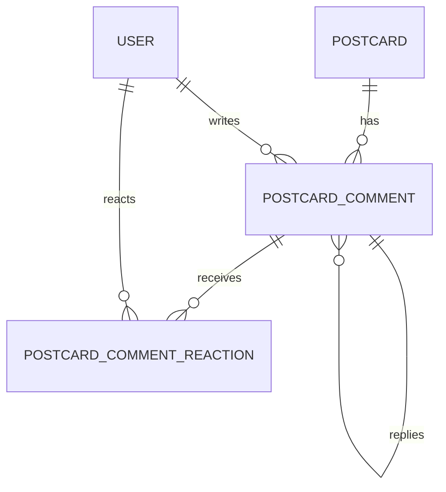

# PostcardComment

## 역할

`PostcardComment`는 엽서에 남기는 댓글과 대댓글을 저장하는 모델.

- `postcardId`: 댓글이 달린 엽서
- `userId`: 댓글 작성자
- `parentId`: 대댓글인 경우 답글 대상 댓글
- `text`: 댓글 내용
- `updatedAt`: 댓글 수정 시각

## 관계



`parent`와 `replies`는 같은 `PostcardComment` 모델을 연결하는 자기 참조 관계.

```text
댓글 A
├── 대댓글 B
└── 대댓글 C
```

- 원댓글: `parentId = null`
- 대댓글: `parentId`에 원댓글 ID 저장
- `replies`: 해당 댓글에 달린 대댓글 목록

## 주요 필드

| 필드 | 타입 | 설명 |
| --- | --- | --- |
| `id` | `UUID` | 댓글 식별자 |
| `postcardId` | `UUID` | 대상 엽서 식별자 |
| `userId` | `UUID` | 작성자 식별자 |
| `parentId` | `UUID?` | 대댓글의 원댓글 식별자 |
| `text` | `Text` | 댓글 내용 |
| `createdAt` | `DateTime` | 작성 시각 |
| `updatedAt` | `DateTime` | 수정 시각 |

## 삭제 정책

- 엽서 삭제 시 댓글도 함께 삭제
- 댓글 삭제 시 하위 대댓글과 댓글 반응도 함께 삭제
- 댓글 수정은 `userId`가 현재 사용자와 일치할 때만 허용

## 댓글 반응

`PostcardCommentReaction`에서 댓글의 하트·이모지 반응을 별도로 관리.

- `commentId`, `userId`, `emoji` 조합 중복 방지
- 엽서 반응과 댓글 반응의 대상이 다르므로 별도 모델로 분리
