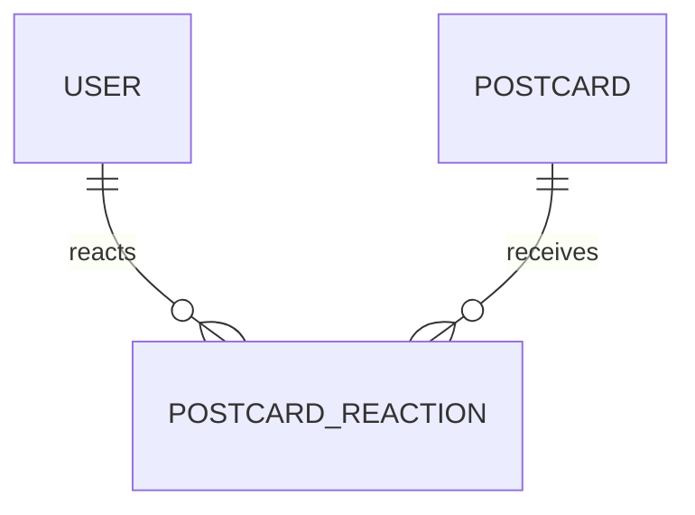

# PostcardReaction

## 역할

엽서에 남긴 하트·이모지 반응 저장 모델.

## 관계

## 주요 필드

| 필드 | 타입 | 설명 |
| --- | --- | --- |
| `id` | `UUID` | 반응 식별자 |
| `postcardId` | `UUID` | 대상 엽서 식별자 |
| `userId` | `UUID` | 반응을 남긴 사용자 식별자 |
| `emoji` | `String` | 하트 또는 이모지 값 |
| `createdAt` | `DateTime` | 반응 시각 |

## 반응 처리

- 같은 이모지 재클릭: 반응 취소
- 다른 이모지 선택: 기존 반응 변경
- 새로운 반응: 반응 생성
- 이모지별 개수 집계로 인기 엽서·인기 이모지 확장 가능
