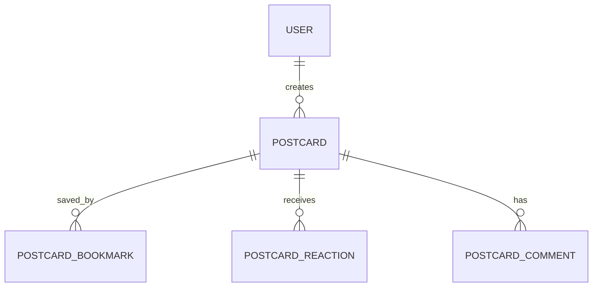

# Postcard

## 역할

사용자가 영화에 대한 외국어 원문과 한국어 문구, 포스터를 저장해 공개하거나 비공개로 관리하는 엽서 원본 모델.

## 관계

## 주요 필드

| 필드 | 타입 | 설명 |
| --- | --- | --- |
| `id` | `UUID` | 엽서 식별자 |
| `userId` | `UUID` | 작성자 식별자 |
| `tmdbId` | `Int` | 연결된 TMDB 영화 식별자 |
| `movieTitle` | `String?` | 저장 당시 영화 제목 |
| `originalText` | `Text?` | 외국어 원문. 원문이 없는 직접 작성 엽서는 `null` 허용 |
| `text` | `Text` | 엽서 문구 |
| `posterPath` | `String?` | TMDB 포스터 경로 |
| `isPublic` | `Boolean` | 공개 여부 |
| `isPinned` | `Boolean` | MY CINEMA 대표 엽서 고정 여부. 사용자당 최대 3개 |
| `createdAt` | `DateTime` | 작성 시각 |
| `updatedAt` | `DateTime` | 수정 시각 |

## 설계 기준

- `originalText`는 외국어 원문과 한국어 엽서 문구를 함께 보존하기 위한 선택 필드
- `originalText`의 실제 PostgreSQL 컬럼명은 `original_text`
- AI 추천 문구를 선택하거나 사용자가 직접 입력할 수 있으며, 원문이 없으면 `null` 저장
- `tmdbId`는 엽서 수정 대상이 아님. 엽서가 어떤 영화를 가리키는지 유지하기 위함
- `isPublic=false`인 엽서는 공개 목록과 보관 목록에서 제외
- `isPinned=true`인 엽서는 MY CINEMA의 대표 엽서로 사용하며 사용자당 최대 3개까지 고정 가능
- 작성자만 본인의 엽서 수정·삭제 가능
- 엽서 삭제 시 북마크·반응·댓글도 함께 삭제
