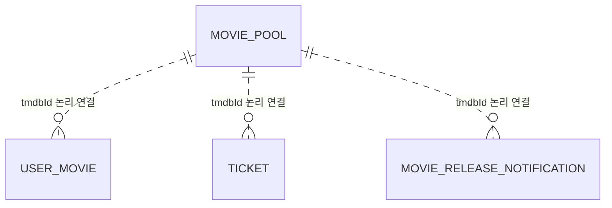

# MoviePool

- 테이블: `movie_pool`
- 목적: 뽑기와 개봉 예정 화면에서 사용하는 영화 원천 데이터

## 관계 요약

DB 외래 키가 없는 TMDB 식별자 기반 연결.

## 주요 필드

| 필드 | 설명 |
|---|---|
| `id` | UUID 기본 키 |
| `tmdbId` | TMDB 영화 식별자, unique |
| `title`, `overview` | 영화 제목·줄거리 |
| `posterPath` | TMDB 포스터 경로 |
| `releaseDate` | 개봉일 문자열 |
| `director` | 감독 |
| `genreIds`, `originCountries` | 장르·제작 국가 배열 |
| `providers` | OTT 제공 정보 JSON |
| `syncedAt` | TMDB 동기화 시각 |

## 관계

`UserMovie`, `Ticket`, `MovieReleaseNotification`이 `tmdbId`로 연결되는 논리적 원천. DB 외래 키는 없음.
