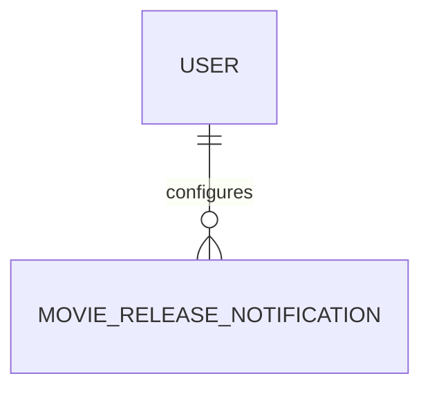

# MovieReleaseNotification

- 테이블: `movie_release_notifications`
- 목적: 보고 싶어요 영화의 개봉일 이메일 알림 상태

## 관계 요약

`tmdbId`로 `MoviePool`과 논리적으로 연결되며 DB 외래 키는 아님.

## 주요 필드

| 필드 | 설명 |
|---|---|
| `id` | UUID 기본 키 |
| `userId` | 알림 사용자 외래 키 |
| `tmdbId` | 대상 영화 |
| `releaseDate` | 알림 기준 개봉일 |
| `enabled` | 알림 활성화 여부 |
| `sentAt` | 해당 개봉일 알림 발송 완료 시각 |
| `createdAt`, `updatedAt` | 생성·수정 시각 |

## 처리 기준

- `(userId, tmdbId)` unique
- `enabled=true`이고 `sentAt`이 비어 있는 알림이 발송 대상
- 개봉일 변경 시 `sentAt` 초기화
- 사용자 삭제 시 알림 cascade 삭제
