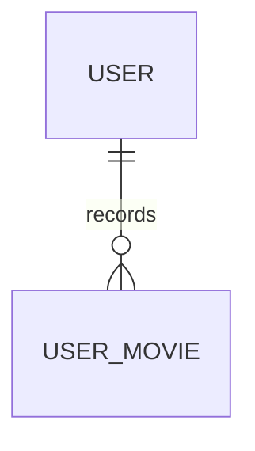

# UserMovie

- 테이블: `user_movies`
- 목적: 사용자의 보고 싶은 영화와 관람 기록

## 관계 요약

`tmdbId`로 `MoviePool`과 논리적으로 연결되며 DB 외래 키는 아님.

## 주요 필드

| 필드 | 설명 |
|---|---|
| `id` | UUID 기본 키 |
| `userId` | 사용자 외래 키 |
| `tmdbId` | TMDB 영화 식별자 |
| `kind` | `wish` 또는 `watched` |
| `watchedAt` | 관람 일시 |
| `viewingType`, `viewingTypeCustom` | 관람 방식 |
| `viewingPlatform`, `viewingLocation` | 관람 플랫폼·장소 |
| `review` | 개인 감상 메모 |
| `rating` | 개인 별점 |
| `isDisplayed`, `displayOrder`, `wallSlot` | MY CINEMA 노출 설정 |

## 제약

- `(userId, tmdbId, kind)` unique
- `review`는 공개 게시물이 아닌 개인 기록
