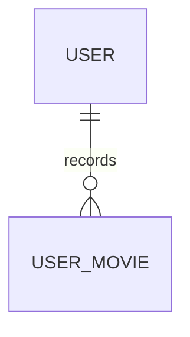

# UserMovie

- 테이블: `user_movies`
- 목적: 사용자의 보고 싶은 영화와 관람 기록

## 관계 요약



`tmdbId`로 `MoviePool`과 논리적으로 연결되며 DB 외래 키는 아님.

## 주요 필드

| 필드 | 설명 |
|---|---|
| `id` | UUID 기본 키 |
| `userId` | 사용자 외래 키 |
| `tmdbId` | TMDB 영화 식별자 |
| `kind` | `wish` 또는 `watched` |
| `watchedAt` | 관람 일시 |
| `viewingType`, `viewingTypeCustom` | 관람 방식 |
| `viewingPlatform`, `viewingPlace` | 관람 플랫폼·장소 |
| `review` | 개인 감상 메모 |
| `rating` | 개인 별점 |
| `isDisplayed`, `wallSlot` | MY CINEMA 노출 설정 |

## 제약

- `(userId, tmdbId, kind)` unique
- `review`는 공개 게시물이 아닌 개인 기록

## 메타데이터와의 분리

`user_movies`에는 감독·배우·장르를 직접 저장하지 않는다.
영화 식별자인 `tmdbId`만 `movie_pool`과 논리적으로 연결한다.

애플리케이션 필드명은 `viewingPlace`로 사용한다.
Prisma의 `@map("viewing_location")` 때문에 PostgreSQL의 실제 컬럼명만 `viewing_location`으로 남아 있다.

## 관람 기록 모달 연결

```txt
UserMovieShelf
  ├─ PosterPickerModal
  │    └─ 영화 검색 결과의 tmdbId·title·poster_path 전달
  └─ WatchedRecordModal
       └─ WatchedRecordForm
            └─ viewingPlace 입력·영화관 검색·장소 저장
```

### `PosterPickerModal`

- 영화 제목 검색과 포스터 선택만 담당
- 선택한 `MovieSearchItem`을 상위 `UserMovieShelf`로 전달
- 영화 상세 조회나 감독·배우 조회를 담당하지 않음

### `WatchedRecordModal`

- 선택한 영화의 관람 기록 입력을 담당
- `WatchedRecordForm`의 값을 저장 API payload로 변환
- `viewingPlace`를 기준으로 영화관 DB와 장소 검색 결과를 연결
- 영화관을 선택하면 `cinemaId`를 함께 저장

### `MovieDetailModal`

- 영화 차트·개봉 예정 화면에서 영화 상세와 관람 정보를 함께 보여주는 별도 모달
- 관람 정보 필드명은 `WatchedRecordModal`과 동일하게 `viewingPlace`를 사용

관람 기록 추가 흐름에서는 `MovieDetailModal`을 거치지 않는다.
`PosterPickerModal → WatchedRecordModal → WatchedRecordForm`으로만 연결한다.

관람 기록 추가 흐름에서는 검색 결과의 `tmdbId`, 제목, 포스터만 사용한다.
감독·배우 통계가 필요해질 때 영화 메타데이터와 크레딧을 별도로 동기화한 뒤 통계 API에서 조인한다.

## 현재 서비스 경계

`user_movies`를 사용하는 기능이 서로 비슷하더라도 서비스의 책임은 분리한다.

| 서비스 | 책임 |
|---|---|
| `UserMovieService` | 영화 보관·삭제, 관람 상세 수정, `wish`·`watched` 목록 조회, 상태·개수 조회 |
| `UserMovieStatsService` | 연도별 관람 횟수·월별 통계 |
| `UserMovieDisplayService` | 홈 티켓 표시 상태와 `wallSlot` 관리 |
| `UserMovieReleaseNotificationService` | 보고 싶은 영화의 개봉일 알림 설정·발송 데이터 |

`UserMovieService`가 관람기록의 중심 서비스이지만 모든 user movie 기능을 한 메서드에 넣지는 않는다.

## `kind`를 사용하는 이유

`wish`와 `watched`는 같은 영화 보관 관계이고 공통 식별자·사용자 관계를 공유하므로 `user_movies` 테이블 하나에서 `kind`로 구분한다.

```ts
type UserMovieKind = 'wish' | 'watched';
```

`(userId, tmdbId, kind)`가 unique이므로 같은 영화가 다음처럼 동시에 존재할 수 있다.

```txt
user + movie + wish
user + movie + watched
```

### 토글·상태·개수의 차이

- `toggle`: `wish` 또는 `watched` 행이 없으면 생성하고 있으면 삭제함
- `getMovieStatus`: 특정 영화에 대해 `wish`, `watched` 행이 존재하는지 boolean으로 반환함
- `getCounts`: 사용자의 `wish`, `watched` 행 개수를 각각 계산함

`status`와 `counts`는 DB 컬럼이 아니다. DB에는 `user_movies` 행과 `kind`가 저장되고, 두 메서드가 API 응답 객체를 조합한다.

영화 상태 조회 API는 다음 경로를 사용한다.

```txt
GET /user-movies/status?tmdbId=<movie-id>
  → UserMovieController.getMovieStatus()
  → UserMovieService.getMovieStatus()
  → { tmdbId, wish, watched }
```

## 관람 상세 수정

`PATCH /user-movies/viewing-details`는 영화의 TMDB 상세정보를 수정하는 API가 아니다. `user_movies`의 개인 관람 기록 필드만 수정한다.

```txt
watchedAt
viewingType
viewingTypeCustom
viewingPlatform
viewingPlace
cinemaId
review
rating
```

PATCH이므로 DTO 필드가 `undefined`이면 기존 값을 유지하고, `null`이면 해당 값을 비운다.

```ts
...(dto.rating !== undefined ? { rating: dto.rating } : {})
```

- `undefined`: 수정하지 않음
- 숫자: 평점 수정
- `null`: 평점 삭제

배우·감독·장르 같은 영화 메타데이터는 `user_movies`에 저장하지 않는다. 필요하면 `tmdbId`를 기준으로 `TmdbService`에서 조회하거나 별도 메타데이터·통계 모델에서 관리한다.

## 영화 데이터와 `tmdbId`

`user_movies`에는 영화 제목·포스터를 저장하지 않고 `tmdbId`만 저장한다.

관람기록 목록 조회 시 흐름은 다음과 같다.

```txt
user_movies 조회
  → 각 row의 tmdbId 확인
  → TmdbService.getMovieCached(tmdbId)
  → UserMovieListItemDto의 movie 필드에 조합
```

`MovieSummaryDto`는 조회를 실행하는 객체가 아니다. `movie` 응답의 모양과 Swagger 스키마를 정의하는 DTO이며, 실제 TMDB 조회는 `TmdbService`가 담당한다.

## 목록 응답과 페이지네이션

`GET /user-movies?kind=watched|wish&take=9&cursor=<id>` 형태로 조회한다.

```txt
UserMovieListResponseDto
├─ items: UserMovieListItemDto[]
├─ hasNext: boolean
└─ nextCursor: string | null
```

`UserMovieListItemDto` 하나에는 개인 관람 정보와 `movie: MovieSummaryDto`가 함께 들어간다.

```txt
UserMovieService.listByKind()
├─ user_movies에서 kind별 row 조회
├─ take + 1개 조회하여 다음 페이지 존재 여부 확인
├─ cursor가 있으면 cursor row 다음부터 조회
└─ tmdbId별 영화 요약정보를 붙여 반환
```

`take`는 페이지 크기이고 `cursor`는 다음 페이지를 시작할 기준 row ID이다. `hasNext`와 `nextCursor`는 Web의 `더 보기` 버튼을 위해 사용한다.

## 관람 장소와 영화관 연결

관람 장소는 두 값을 분리한다.

| 필드 | 의미 |
|---|---|
| `viewingPlace` | 사용자가 실제로 입력하거나 선택한 장소명. 영화관이 아니어도 저장 가능 |
| `cinemaId` | CINEMO의 `cinemas` 테이블과 연결된 영화관 ID. DB 영화관을 선택했을 때만 저장 |

장소 검색은 영화관 DB 검색과 Kakao 장소 검색을 각각 수행할 수 있다. 영화관 DB 결과를 선택하면 `cinemaId`와 `viewingPlace`를 함께 저장하고, 일반 장소를 입력하거나 선택하면 `cinemaId`는 `null`로 둔다.

`PlaceSearchResult`는 API 응답 DTO에서 생성된 타입을 Web이 사용한다.

```txt
apps/api/src/places/dto/place-search-result.dto.ts
  → Swagger/OpenAPI
  → @cinemo/api-contract
  → Web 장소 검색 타입
```

DTO가 장소를 조회하는 것이 아니라 `PlacesService`가 Kakao API를 호출하고, DTO는 응답 구조만 정의한다.

## Web 컴포넌트 흐름

```txt
UserMovieShelf(kind="watched")
├─ 목록 조회·페이지네이션·검색 상태
├─ 영화 카드 전체 클릭
├─ PosterPickerModal
│    └─ 영화 검색·포스터 선택
└─ WatchedRecordModal
     └─ WatchedRecordForm
          └─ 관람일·장소·방식·플랫폼·후기·평점 저장
```

`UserMovieShelf`는 `kind`를 받아 같은 목록 컴포넌트를 `wish`와 `watched`에 재사용한다. `kind`는 API 조회 조건과 화면 분기 기준이며, `toggle` 하나만 사용한다는 이유로 컴포넌트를 재사용하는 것은 아니다.

`WatchedRecordModal`은 부모가 전달한 영화·기존 `UserMovieListItem`·홈 티켓 표시 상태를 사용한다. 모달은 API와 목록 상태를 직접 소유하지 않고 `onClose`, `onSaved`, `onToggleDisplay` 콜백으로 부모에 이벤트를 전달한다.

## 현재 범위에서 제외한 것

- 관람기록 저장 시 TMDB 상세·배우·감독을 반드시 다시 조회하지 않음
- `MovieSummaryDto`가 외부 API를 직접 호출하지 않음
- `status`, `counts`를 DB에 별도 저장하지 않음
- 관람기록에 달력 전용 서비스나 `UserMovieCalendar`를 두지 않음
- 관람기록 목록에서 영화 포스터 원본을 DB에 저장하지 않음
