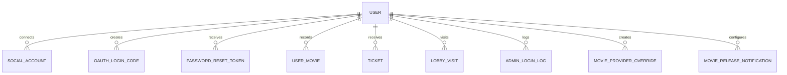

# User

- 테이블: `users`
- 목적: 로그인 사용자와 CINEMO 활동의 기준 엔티티

## 관계 요약

## 주요 필드

| 필드 | 설명 |
|---|---|
| `id` | UUID 기본 키 |
| `email` | 이메일 로그인 ID, unique |
| `passwordHash` | bcrypt 비밀번호 해시 |
| `nickname` | 화면 표시 닉네임, unique |
| `role` | `user` 또는 `admin` |
| `lastLoginProvider` | 마지막 로그인 수단 |
| `avatarConfig` | 아바타 설정 JSON |
| `profilePublic`, `tags`, `bio` | 프로필 공개·태그·소개 |
| `isTestAccount` | 테스트 계정 여부 |

## 관계

사용자 삭제 시 각 관계 데이터의 cascade 정책은 모델별 설정에 따름.
