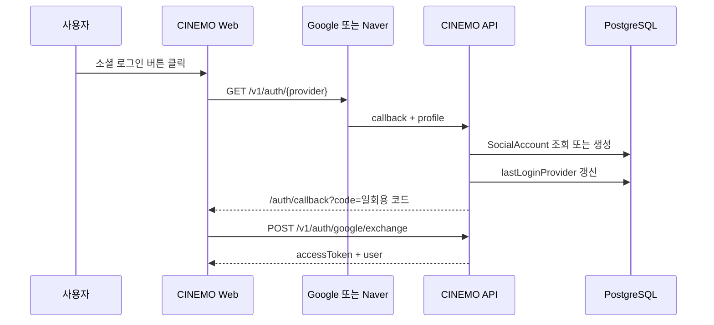

# 소셜 로그인

Google·Naver OAuth 로그인 연동 문서.

영화 데이터를 가져오는 외부 API 문서와 분리. 소셜 로그인은 외부 서비스의 인증 결과를 CINEMO 사용자 계정과 연결하는 기능.

## Provider 상태

| Provider | 상태 | 기록 |
| --- | --- | --- |
| Google | 사용 | OAuth 로그인 구현·운영 기준 정리 |
| Naver | 사용 | OAuth 로그인 구현·운영 기준 정리 |
| Kakao | 보류 | 이메일 제공 권한과 비즈 앱 전환 조건 확인 필요 |
| Apple | 보류 | Apple Developer Program 연간 비용과 추가 설정 부담 |

Kakao·Apple 로그인 버튼은 현재 비활성화 상태. 이후 필요한 권한·비용·운영 조건을 확인한 뒤 재개.

## 공통 흐름



## 공통 계정 연결 기준

1. `provider + providerAccountId`로 기존 `SocialAccount` 조회
2. 같은 이메일의 `User`가 있으면 해당 계정에 소셜 계정 연결
3. 일치하는 사용자가 없으면 새 `User`와 `SocialAccount` 생성
4. 로그인한 provider를 `User.lastLoginProvider`에 기록
5. Web에서 `cinemo_recent_login_provider`로 최근 로그인 방식 표시

소셜 provider의 access token은 Web에 저장하지 않음. API가 provider profile을 확인한 뒤 CINEMO 자체 JWT를 발급.

## Callback URL 기준

OAuth provider에 등록하는 callback URL은 Web 배포 주소가 아닌 API 배포 주소 사용.

```txt
로컬
http://localhost:3050/v1/auth/{provider}/callback

배포
https://{Railway API 도메인}/v1/auth/{provider}/callback
```

Vercel 주소는 로그인 화면과 `/auth/callback`을 제공하는 Web 주소. Google·Naver가 인증 결과를 돌려보내는 callback은 Railway에 배포된 CINEMO API가 수신.

| 주소 | 역할 |
| --- | --- |
| Vercel Web URL | 로그인 화면·OAuth code 처리 화면 |
| Railway API URL | Google·Naver OAuth callback 수신·사용자 연결 |

callback URL은 각 provider 콘솔의 등록 값과 `apps/api/.env` 또는 Railway API Variables의 `*_CALLBACK_URL` 값이 일치해야 함.

## 문서 목록

| 문서 | 내용 |
| --- | --- |
| [google.md](./google.md) | Google OAuth 설정·전략·콜백·계정 연결 |
| [naver.md](./naver.md) | Naver OAuth 설정·전략·콜백·이메일 동의 |

## 연결 파일

```txt
apps/api/src/auth/auth.controller.ts
apps/api/src/auth/auth.service.ts
apps/api/src/auth/auth.module.ts
apps/api/src/auth/google.strategy.ts
apps/api/src/auth/naver.strategy.ts
apps/api/src/auth/types/social-profile.type.ts
apps/api/src/config/env.keys.ts
apps/api/src/config/env.validation.ts
apps/web/app/(auth)/login/page.tsx
apps/web/app/auth/callback/page.tsx
apps/web/lib/auth-api.ts
apps/web/lib/auth-store.ts
```

공통 사용자·소셜 계정 모델은 [prisma/auth/social-account.md](../prisma/auth/social-account.md) 참고.
