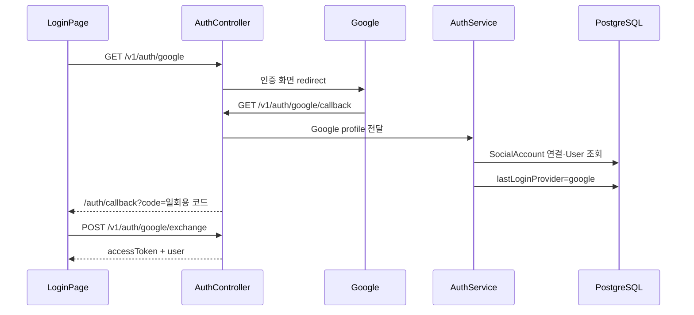

# Google 로그인

Google OAuth 2.0과 Passport 전략을 이용한 로그인.

## 사용하는 패키지

| 패키지 | 버전 | 용도 |
| --- | --- | --- |
| `passport-google-oauth20` | `^2.0.0` | Google OAuth 2.0 Passport 전략 |
| `@types/passport-google-oauth20` | `^2.0.17` | TypeScript 타입 |
| `@nestjs/passport` | `^11.0.5` | NestJS Passport 연결 |
| `passport` | `^0.7.0` | 인증 전략 기반 |

## Google Cloud 설정 위치

```txt
Google Cloud Console
  → APIs & Services
  → Credentials
  → OAuth 2.0 Client ID
```

OAuth 클라이언트 생성 후 CINEMO API callback URL을 승인된 리디렉션 URI에 등록.

```txt
로컬
http://localhost:3050/v1/auth/google/callback

배포
https://{API 도메인}/v1/auth/google/callback
```

callback URL은 코드의 환경변수 값과 Google Cloud Console 등록 값이 한 글자까지 일치해야 함.

## 환경변수

```env
GOOGLE_CLIENT_ID=Google OAuth 클라이언트 ID
GOOGLE_CLIENT_SECRET=Google OAuth 클라이언트 보안 비밀
GOOGLE_CALLBACK_URL=http://localhost:3050/v1/auth/google/callback
```

| 변수 | 용도 |
| --- | --- |
| `GOOGLE_CLIENT_ID` | Google OAuth 클라이언트 식별 |
| `GOOGLE_CLIENT_SECRET` | API 서버의 OAuth 클라이언트 인증 |
| `GOOGLE_CALLBACK_URL` | Google 인증 후 돌아올 API 주소 |

등록 위치:

```txt
로컬   apps/api/.env
배포   Railway API Variables
키 목록 apps/api/src/config/env.keys.ts
검증   apps/api/src/config/env.validation.ts
```

`GOOGLE_CLIENT_SECRET`은 Web에 노출하지 않음. `.env`와 Secret은 Git에 커밋하지 않음.

## Passport 전략

파일: `apps/api/src/auth/google.strategy.ts`

```ts
super({
  clientID: GOOGLE_CLIENT_ID,
  clientSecret: GOOGLE_CLIENT_SECRET,
  callbackURL: GOOGLE_CALLBACK_URL,
  scope: ['email', 'profile'],
});
```

Google profile에서 사용하는 값:

| Google profile | CINEMO 값 | 용도 |
| --- | --- | --- |
| `profile.id` | `providerAccountId` | Google 계정 식별 |
| `profile.emails[0].value` | `email` | 계정 연결·생성 |
| `profile.displayName` | `nickname` | CINEMO 닉네임 후보 |

이메일을 제공받지 못하면 `UnauthorizedException` 발생. 이메일 scope는 현재 로그인에 필수.

## 로그인 API 흐름



### Endpoint

```txt
GET  /v1/auth/google
GET  /v1/auth/google/callback
POST /v1/auth/google/exchange
```

- 시작 endpoint와 callback은 `@Public()` + `AuthGuard('google')`
- callback에서 provider profile을 CINEMO 계정으로 변환
- OAuth callback에서 access token을 직접 query string으로 전달하지 않음
- API가 1분 유효 일회용 `OAuthLoginCode` 생성
- `FRONTEND_URL/auth/callback?code=...`로 redirect
- Web callback page가 일회용 code를 exchange해 CINEMO JWT 수령
- OAuth code 교환 이후 Web 세션과 최근 로그인 방식 저장

현재 `POST /v1/auth/google/exchange`는 Google 전용 provider token 교환 endpoint가 아님. Naver callback도 같은 CINEMO 일회용 OAuth code 형식을 사용하므로 공통 교환 로직을 호출. endpoint 이름은 기존 호환성을 유지한 상태.

## 계정 연결

`AuthService.loginWithSocial()`이 Google profile을 처리.

```txt
SocialAccount(provider=google, providerAccountId) 조회
  → 있으면 기존 User 로그인
  → 없으면 같은 email의 User 조회
      → 있으면 SocialAccount 연결
      → 없으면 User + SocialAccount 생성
  → User.lastLoginProvider = google
```

새 소셜 계정 생성 시 초기 비밀번호는 랜덤 값. Google 로그인 사용자가 이메일 비밀번호 로그인을 별도로 사용하지 못하도록 provider 계정과 이메일 연결을 기준으로 관리.

## Web 로그인 버튼

파일: `apps/web/app/(auth)/login/page.tsx`

```ts
const apiUrl = process.env.NEXT_PUBLIC_API_URL ?? 'http://localhost:3050';
window.location.href = `${apiUrl}/v1/auth/google`;
```

Web은 Google API를 직접 호출하지 않음. API의 `/v1/auth/google`로 이동만 수행.

## 확인 순서

1. Google Cloud Console의 OAuth 동의 화면과 OAuth 클라이언트 설정
2. 승인된 callback URL 등록
3. `apps/api/.env`에 세 환경변수 등록
4. API 서버의 환경변수 검증 통과 확인
5. `/login`에서 Google 버튼 선택
6. Google 인증 후 `/auth/callback` 이동 확인
7. 로비 이동과 `lastLoginProvider=google` 확인
8. 같은 계정 재로그인 시 `최근 사용` 표시 확인

관련 공통 흐름은 [README.md](./README.md), 계정 모델은 [../prisma/auth/social-account.md](../prisma/auth/social-account.md) 참고.
