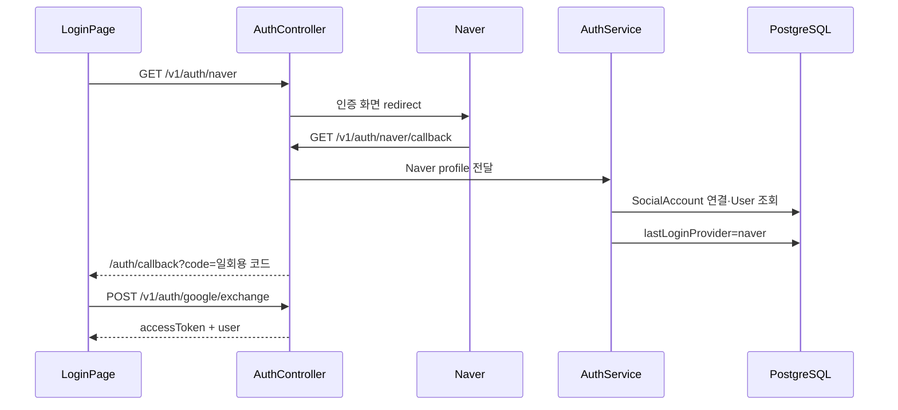

# Naver 로그인

Naver OAuth와 Passport 전략을 이용한 로그인.

## 사용하는 패키지

| 패키지 | 버전 | 용도 |
| --- | --- | --- |
| `passport-naver-v2` | `^2.0.8` | Naver OAuth Passport 전략 |
| `@types/passport-naver` | `^1.0.4` | 현재 프로젝트에 남아 있는 Naver 타입 패키지 |
| `@nestjs/passport` | `^11.0.5` | NestJS Passport 연결 |
| `passport` | `^0.7.0` | 인증 전략 기반 |

현재 전략의 실제 import 대상은 `passport-naver-v2`.
`NaverStrategy`에서 타입 호환을 위해 `Strategy as any`를 사용하는 상태.

## Naver Developers 설정 위치

```txt
네이버 개발자센터
  → Application
  → 애플리케이션 등록
  → API 설정
  → 회원 이용정보
```

애플리케이션 등록 후 네이버 로그인 사용 설정과 이메일 제공 항목을 확인. CINEMO는 Naver profile의 이메일을 계정 연결에 사용.

callback URL 등록:

```txt
로컬
http://localhost:3050/v1/auth/naver/callback

배포
https://{API 도메인}/v1/auth/naver/callback
```

## 환경변수

```env
NAVER_CLIENT_ID=Naver 애플리케이션 클라이언트 ID
NAVER_CLIENT_SECRET=Naver 애플리케이션 클라이언트 시크릿
NAVER_CALLBACK_URL=http://localhost:3050/v1/auth/naver/callback
```

| 변수 | 용도 |
| --- | --- |
| `NAVER_CLIENT_ID` | Naver OAuth 클라이언트 식별 |
| `NAVER_CLIENT_SECRET` | API 서버의 OAuth 클라이언트 인증 |
| `NAVER_CALLBACK_URL` | Naver 인증 후 돌아올 API 주소 |

등록 위치:

```txt
로컬   apps/api/.env
배포   Railway API Variables
키 목록 apps/api/src/config/env.keys.ts
검증   apps/api/src/config/env.validation.ts
```

`NAVER_CLIENT_SECRET`은 Web에 노출하지 않음. `.env`와 Secret은 Git에 커밋하지 않음.

## Passport 전략

파일: `apps/api/src/auth/naver.strategy.ts`

```ts
super({
  clientID: NAVER_CLIENT_ID,
  clientSecret: NAVER_CLIENT_SECRET,
  callbackURL: NAVER_CALLBACK_URL,
});
```

Naver profile에서 사용하는 값:

| Naver profile | CINEMO 값 | 용도 |
| --- | --- | --- |
| `profile.id` | `providerAccountId` | Naver 계정 식별 |
| `profile.email` | `email` | 계정 연결·생성 |
| `profile.nickname` | `nickname` | CINEMO 닉네임 후보 |
| `profile.name` | nickname fallback | 닉네임 보완 |

이메일을 제공받지 못하면 `UnauthorizedException` 발생. 네이버 로그인 설정에서 이메일 제공 동의가 필요.

닉네임 선택 순서:

```txt
profile.nickname.trim()
  → profile.name.trim()
  → naver-{providerAccountId 앞 8자리}
```

## 로그인 API 흐름



### Endpoint

```txt
GET  /v1/auth/naver
GET  /v1/auth/naver/callback
POST /v1/auth/google/exchange
```

- 시작 endpoint와 callback은 `@Public()` + `AuthGuard('naver')`
- callback에서 provider profile을 CINEMO 계정으로 변환
- API가 1분 유효 일회용 `OAuthLoginCode` 생성
- `FRONTEND_URL/auth/callback?code=...`로 redirect
- Web callback page가 공통 exchange endpoint를 호출해 CINEMO JWT 수령
- Naver 로그인 성공 후 `lastLoginProvider=naver` 기록

`/google/exchange`라는 이름은 현재 구현의 공통 OAuth code 교환 endpoint 이름. Naver가 Google API를 호출한다는 의미가 아님.

## 계정 연결

`AuthService.loginWithSocial()`이 Naver profile을 처리.

```txt
SocialAccount(provider=naver, providerAccountId) 조회
  → 있으면 기존 User 로그인
  → 없으면 같은 email의 User 조회
      → 있으면 SocialAccount 연결
      → 없으면 User + SocialAccount 생성
  → User.lastLoginProvider = naver
```

## Web 로그인 버튼

파일: `apps/web/app/(auth)/login/page.tsx`

```ts
const apiUrl = process.env.NEXT_PUBLIC_API_URL ?? 'http://localhost:3050';
window.location.href = `${apiUrl}/v1/auth/naver`;
```

Web은 Naver API를 직접 호출하지 않음. API의 `/v1/auth/naver`로 이동만 수행.

## 확인 순서

1. 네이버 개발자센터에서 애플리케이션 등록
2. 네이버 로그인 사용 설정과 이메일 제공 항목 확인
3. 승인된 callback URL 등록
4. `apps/api/.env`에 세 환경변수 등록
5. API 서버의 환경변수 검증 통과 확인
6. `/login`에서 Naver 버튼 선택
7. 이메일 제공 동의 후 `/auth/callback` 이동 확인
8. 로비 이동과 `lastLoginProvider=naver` 확인
9. 같은 계정 재로그인 시 `최근 사용` 표시 확인

관련 공통 흐름은 [README.md](./README.md), 계정 모델은 [../prisma/auth/social-account.md](../prisma/auth/social-account.md) 참고.
