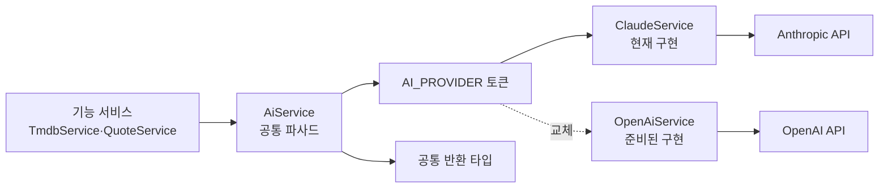
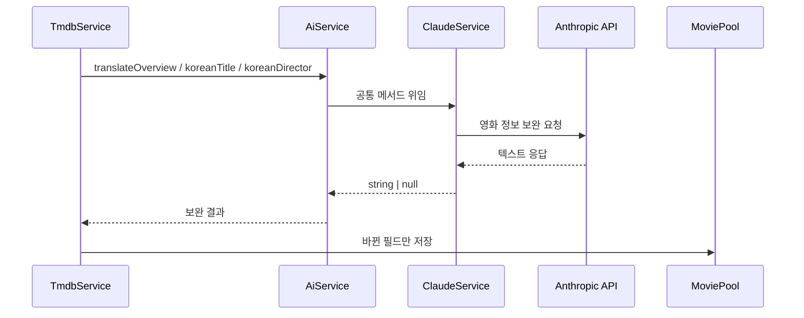
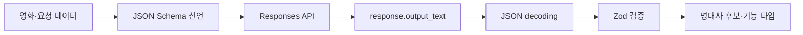
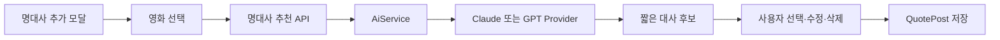

# AI Provider · Claude · GPT

CINEMO의 AI 연동 구조와 Provider 교체 규칙을 정리한 문서임.

현재 AI는 TMDB 영화 정보의 한국어 보완과 영화 명대사 추천에 사용함. 기능 코드가 특정 AI SDK에 직접 의존하지 않도록 `IAiProvider` 추상화 아래에서 관리함.

## 현재 상태 요약

```txt
활성 Provider      ClaudeService
준비된 Provider    OpenAiService
Provider 선택 위치 apps/api/src/ai/ai.module.ts
명대사 API         POST /v1/ai/quote-suggestions · JWT 필요
명대사 결과        원문·한국어 번역·원문 언어·인기 여부·출처
```

현재 `AiModule`에서는 Claude가 활성화되어 있고 OpenAI Provider 등록은 주석 처리되어 있음. OpenAI로 전환할 때는 `AI_PROVIDER`의 `useClass`만 바꾸되, 환경 변수와 SDK 응답 파싱·오류 처리를 함께 확인해야 함.

## 전체 연결 구조



핵심 원칙:

- 기능 서비스는 `ClaudeService`나 `OpenAiService`를 직접 import하지 않음
- `AiService`가 공통 메서드를 제공하고 Provider 구현체를 주입받음
- Provider를 교체해도 TMDB·명대사 기능의 호출 코드는 유지함
- API 키는 서버 환경 변수로만 관리하고 Web 번들에 포함하지 않음

## 현재 구현

```txt
apps/api/src/ai/
  ai.interface.ts   IAiProvider · AI_PROVIDER 토큰
  ai.service.ts     Provider 공통 파사드
  claude.service.ts ClaudeService · Anthropic SDK 호출
  openai.service.ts OpenAiService · OpenAI Responses API 호출
  ai.module.ts      AI_PROVIDER → ClaudeService 주입
  ai.controller.ts  JWT 보호 명대사 추천 HTTP 라우트
```

현재 `IAiProvider` 메서드:

```ts
translateOverview(titleEn, overviewEn): Promise<string | null>
koreanTitle(titleEn, year): Promise<string | null>
koreanDirector(name): Promise<string | null>
```

현재 호출 흐름:



실패 시 `null`을 반환하고 기존 TMDB 문자열을 유지함. 백그라운드 보완 흐름에서는 영화 카드의 첫 응답을 막지 않도록 `void` 호출함.

## 영화 줄거리 보완

개봉 예정 영화 상세에서 TMDB 한국어 줄거리가 비어 있거나 너무 짧은 경우에만 영어 원문을 기준으로 번역함.

```txt
TMDB ko-KR Details
  ├─ 정상 길이 → 그대로 사용
  └─ 빈 값·80자 미만·한 문장
       ↓
    TMDB en-US overview
       ↓
    translateOverview()
       ↓
    MoviePool에 보정 결과 저장
```

번역 프롬프트의 기준:

- 줄거리 요약이나 창작이 아니라 충실한 번역
- 등장인물·관계·배경·사건·갈등·목표·위협 정보 유지
- 원문이 짧으면 없는 사실을 추가하지 않음
- 설명 문장·따옴표·제목 없이 번역문만 반환

프롬프트를 바꾼 뒤에는 API 서버를 재시작하고 상세 모달을 다시 요청해야 함. 이미 충분한 길이로 저장된 줄거리는 자동 재번역하지 않음.

## Claude에서 GPT로 교체

Provider 교체는 `ai.module.ts`의 주입 대상만 변경하는 방향임.

```ts
// 현재
{ provide: AI_PROVIDER, useClass: ClaudeService }

// GPT Provider 추가 후
{ provide: AI_PROVIDER, useClass: OpenAiService }
```

Provider 구현체가 지켜야 하는 조건:

- `IAiProvider`의 메서드 시그니처를 모두 구현함
- SDK 응답을 CINEMO 공통 반환 타입으로 변환함
- SDK 오류를 내부에서 처리하고 기능 서비스에는 `null` 또는 빈 배열로 반환함
- Provider 내부에서만 API 키와 모델명을 사용함

```txt
ClaudeService
  SDK      @anthropic-ai/sdk
  호출     claudeClient.messages.create()
  환경 변수 CLAUDE_KEY

OpenAiService (준비된 구현)
  SDK      openai
  호출     responses.create()
  환경 변수 OPENAI_KEY · 선택적 OPENAI_MODEL
```

Claude와 GPT의 응답 형식이 다르므로 기존 `ClaudeService` 코드를 그대로 재사용하지 않음. 공통 인터페이스와 기능 서비스 호출부만 재사용하고, SDK 호출·응답 파싱·오류 처리는 Provider별로 구현함.

## Claude와 OpenAI 구현 차이

Provider를 바꾼다는 것은 서비스 이름만 바꾸는 작업이 아님. 기능 서비스가 의존하는 공통 인터페이스는 유지하지만, 외부 SDK를 호출하는 내부 코드는 각 API 규칙에 맞게 다시 작성해야 함.

| 구분 | Claude 현재 구현 | OpenAI GPT 구현 방향 |
| --- | --- | --- |
| Provider 클래스 | `ClaudeService` | `OpenAiService` |
| SDK 패키지 | `@anthropic-ai/sdk` | `openai` |
| 클라이언트 | `claudeClient` | `openai` 클라이언트 인스턴스 |
| 요청 메서드 | `claudeClient.messages.create()` | `openai.responses.create()` |
| 입력 구조 | `messages` 배열 + `max_tokens` | `input` + `text.format` 등 Responses 옵션 |
| 텍스트 추출 | `msg.content.find(...)?.text` | `response.output_text` |
| 구조화 응답 | 프롬프트로 JSON을 요청한 뒤 직접 파싱 | JSON Schema를 `text.format`에 선언하는 Structured Outputs |
| 인증 키 | `CLAUDE_KEY` | `OPENAI_KEY` |

### 코드 형태의 차이

현재 Claude 쪽은 응답이 content block 배열로 내려오므로 텍스트 block을 찾아야 함.

```ts
const msg = await claudeClient.messages.create({
  model: 'claude-model',
  max_tokens: 512,
  messages: [{ role: 'user', content: prompt }],
});

const text = msg.content.find((item) => item.type === 'text')?.text?.trim();
```

OpenAI Responses API는 응답에서 텍스트를 `output_text`로 읽는 방식임.

```ts
const response = await openai.responses.create({
  model: process.env.OPENAI_MODEL ?? 'gpt-model',
  input: prompt,
});

const text = response.output_text.trim();
```

### 직접 JSON.parse와 Structured Outputs의 차이

기존 방식은 모델에게 JSON을 요청하고, 실제로 JSON인지 확인하지 않은 채 문자열을 직접 파싱하는 구조임.

```ts
// 자유 형식 텍스트를 받은 뒤 애플리케이션이 임의로 파싱함
const text = msg.content.find((item) => item.type === 'text')?.text ?? '';
const result = JSON.parse(text);
```

이 방식의 문제:

- 모델이 설명 문장이나 Markdown fence를 함께 반환할 수 있음
- 필드 이름·타입·필수값이 매번 달라질 수 있음
- `JSON.parse()`의 성공 여부만 확인할 뿐 업무 규칙까지 보장하지 못함

OpenAI에서는 Responses API의 `text.format`에 `json_schema`를 선언해 모델 출력의 구조를 제한함. `strict: true`와 `additionalProperties: false`를 함께 사용하면 예상하지 않은 필드가 섞이는 문제를 줄일 수 있음.

```ts
const response = await openai.responses.create({
  model: process.env.OPENAI_MODEL ?? 'gpt-model',
  input: prompt,
  text: {
    format: {
      type: 'json_schema',
      name: 'movie_quote_suggestions',
      strict: true,
      schema: {
        type: 'object',
        properties: {
          quotes: {
            type: 'array',
            items: {
              type: 'object',
              properties: {
                text: { type: 'string' },
                isPopular: { type: 'boolean' },
              },
              required: ['text', 'isPopular'],
              additionalProperties: false,
            },
          },
        },
        required: ['quotes'],
        additionalProperties: false,
      },
    },
  },
});

// output_text가 JSON 문자열로 제공되는 SDK 버전에서는 transport decoding만 수행함.
// 이후 Zod로 애플리케이션 타입까지 검증해야 함.
const result = MovieQuoteSuggestionsSchema.parse(
  JSON.parse(response.output_text),
);
```

핵심은 `JSON.parse()`를 기계적으로 없애는 것이 아님. 자유 형식 응답을 받고 운에 기대어 파싱하는 패턴을 `Structured Outputs → JSON decoding → Zod 검증` 흐름으로 바꾸는 것임. SDK 버전에 구조화 응답을 바로 반환하는 helper가 있다면 그 helper를 사용하고, 그렇지 않으면 위처럼 `output_text`를 디코딩한 뒤 Zod 검증을 거침.



Structured Outputs가 보장하는 것은 응답 구조임. 실제 영화에 존재하는 대사인지, 실제로 많이 언급된 대사인지는 별도 검증이 필요함. 따라서 `isPopular`를 AI 응답만으로 확정하지 않고, 출처·커뮤니티 데이터·운영자 확인과 분리해야 함.

자세한 요청 옵션과 `responses.create()`, `output_text`, `json_schema` 형식은 [OpenAI Responses API 공식 문서](https://developers.openai.com/api/reference/typescript/resources/beta/subresources/responses/methods/create) 기준으로 확인함.

## 명대사 추천 확장

명대사 추천은 현재 공개 API나 DB 기능으로 구현된 상태가 아님. Provider 확장 시 다음 계약을 추가하는 방식이 자연스러움.

```ts
type RecommendMovieQuotesInput = {
  title: string;
  releaseYear: number | null;
  overview: string | null;
};

type MovieQuoteSuggestion = {
  text: string;
  isPopular: boolean;
};

recommendMovieQuotes(
  input: RecommendMovieQuotesInput,
): Promise<MovieQuoteSuggestion[]>;
```

추천 흐름:



주의사항:

- AI가 실제 영화 대사를 정확히 알고 있다고 가정하지 않음
- `isPopular`는 AI의 추측만으로 확정하면 안 됨
- 실제 인기 명대사는 커뮤니티 데이터·검증된 출처·운영자 확인을 함께 고려함
- 확인되지 않은 대사는 추천 후보로만 보여주고 자동 저장하지 않음
- 사용자가 직접 입력한 대사는 AI 결과와 구분하지 않고 동일하게 수정·삭제할 수 있게 함

## 환경 변수

```txt
# 현재 활성 Provider
CLAUDE_KEY=
CLAUDE_MODEL=

# OpenAI Provider 사용 시
OPENAI_KEY=
OPENAI_MODEL=
```

환경 변수 등록 위치:

- 로컬: `apps/api/.env`
- 예시: `apps/api/.env.example`
- 운영: Railway API 서비스 Secret

Web 환경 변수(`NEXT_PUBLIC_*`)에 AI 키를 넣지 않음. 브라우저에 노출되면 사용자가 직접 외부 AI API를 호출할 수 있어 키 탈취와 비용 오남용 위험이 발생함.

## 실제로 마주친 오류와 원인

### 401 로그인 필요

```json
{
  "message": "로그인이 필요합니다.",
  "error": "Unauthorized",
  "statusCode": 401
}
```

`@ApiBearerAuth()`는 Swagger 문서에 Bearer 입력 UI를 표시하는 데 사용될 뿐 인증을 수행하지 않음. 실제 인증은 `@UseGuards(JwtAuthGuard)`와 요청의 `Authorization: Bearer <JWT>`가 담당함.

```txt
브라우저 → POST /v1/ai/quote-suggestions
         Authorization: Bearer <유효한 CINEMO JWT>
```

### 429 크레딧 부족

```txt
You have no credits remaining. Add credits to continue using the API.
```

OpenAI 키 형식이나 DTO 오류가 아니라 OpenAI 계정의 API 크레딧·결제 한도 문제임. 앱에서 재시도만 반복하면 해결되지 않으며, Billing·Usage·프로젝트 키 권한을 확인해야 함. API 호출 비용은 ChatGPT 구독과 별도일 수 있음.

### Markdown JSON 파싱 실패

```txt
SyntaxError: Unexpected token '`', "```json ..." is not valid JSON
```

Claude가 JSON을 Markdown fence로 감싸 반환했는데 `JSON.parse()`에 원문을 그대로 전달한 오류임. 현재 Claude 구현은 fence를 제거한 뒤 파싱함. 그래도 자유 형식 출력은 깨질 수 있으므로 운영 수준에서는 다음 순서를 사용해야 함.

```txt
Structured Outputs 또는 명시적 JSON 계약
  → 응답 문자열 디코딩
  → Zod 스키마 검증
  → 실패 시 빈 후보 또는 사용자에게 재시도 안내
```

OpenAI 구현은 Responses API의 JSON Schema를 사용하지만, `response.output_text`를 `JSON.parse()`하는 구간에는 여전히 런타임 검증이 필요함. `JSON.parse()`와 Zod 검증을 Provider 내부에 두고 기능 서비스로 예외를 누출하지 않는 방향이 안전함.

## 명대사 추천 품질 규칙

- 분위기나 영화 주제를 새 문장으로 만든 결과가 아니라 실제 영화에 등장한 짧은 대사를 추천해야 함
- 외국 영화는 `originalText`에 원문, `koreanText`에 한국어 번역, `originalLanguage`에 원문 언어를 저장함
- 영어뿐 아니라 일본어·중국어·프랑스어 등 영화의 실제 언어를 유지함
- 사용자가 원문과 한국어 번역을 각각 수정할 수 있어야 함
- 사용자가 AI 추천을 삭제·무시하고 직접 입력한 대사로 바꿀 수 있어야 함
- 인기 명대사 여부는 AI의 추측만으로 확정하지 않음
- 출처가 확인되지 않은 대사는 자동 저장하지 않고 후보로만 표시함
- 예: `음악이 없으면 인생은 실수야`는 영화 대사가 아니라 니체 문구이므로 *비긴 어게인* 명대사로 저장하면 안 됨

## 문서 연결

- TMDB 한국어 보완 → [tmdb.md](./tmdb.md/#한국어-enrich-claude.md)
- 뽑기 결과·영화 메타데이터 → [gacha.md](./gacha.md)
- 외부 API 관리 원칙 → [../api/external-api.md](../api/external-api.md)
