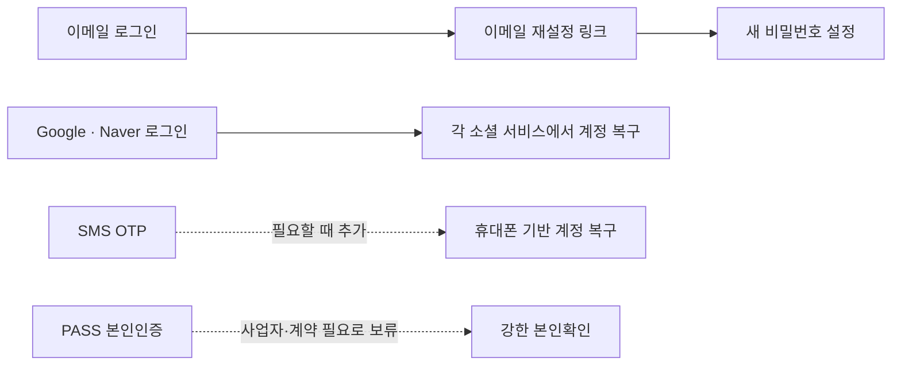
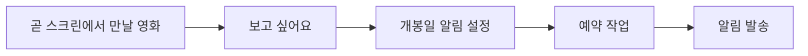

# 인증·비밀번호 찾기 설계

## 현재 결정

CINEMO의 계정 복구는 다음 순서로 진행함.



- 이메일 계정: 이메일 재설정 링크를 기본 복구 수단으로 사용함
- 소셜 계정: 현재 Google·Naver 로그인과 각 제공자의 계정 복구를 사용함
- Kakao 로그인: 이메일 제공 권한 문제로 보류함
- Apple 로그인: Apple Developer Program 연회비와 추가 설정이 필요해 보류함
- SMS OTP: 휴대폰 기반 복구가 실제로 필요해질 때 추가함
- PASS: 초기 CINEMO에는 도입하지 않음

## PASS를 바로 사용하지 않는 이유

PASS는 일반적인 문자 인증처럼 프론트에서 번호만 보내는 기능이 아님. NICE·KCB 등 본인확인 사업자와의 신청·계약·심사, 인증 요청, 콜백, 서버 결과 검증 과정이 필요함.

```txt
사용자
  ↓
CINEMO API에서 인증 세션 생성
  ↓
본인확인 사업자 화면으로 이동
  ↓
PASS 인증
  ↓
사업자 콜백
  ↓
CINEMO 서버에서 서명·거래 상태 검증
  ↓
계정 복구 또는 재설정 토큰 발급
```

따라서 사업자 연동이 준비되지 않은 초기 단계에서는 PASS를 전제로 화면과 DB를 먼저 만들지 않음.

## 1. 이메일 비밀번호 재설정

### 사용자 흐름

```txt
이메일 입력
  ↓
POST /v1/auth/password-reset/request
  ↓
서버가 일회용 토큰 생성
  ↓
이메일로 재설정 링크 발송
  ↓
/reset-password?token=...
  ↓
새 비밀번호 입력
  ↓
POST /v1/auth/password-reset/confirm
```

### 보안 규칙

- 계정이 존재하는지 외부에 노출하지 않음
  - `입력한 이메일이 존재하지 않습니다` 대신 `입력한 이메일로 안내를 확인해 주세요` 사용
- 재설정 토큰 원문은 DB에 저장하지 않고 해시값만 저장함
- 토큰 만료 시간은 10~30분으로 제한함
- 토큰은 성공적으로 사용한 즉시 폐기함
- 같은 토큰으로 여러 번 비밀번호를 바꿀 수 없게 함
- 이메일 발송 요청에 IP·이메일별 rate limit을 적용함
- 새 비밀번호는 기존 로그인 비밀번호와 다르게 요구할 수 있음
- 비밀번호는 평문으로 저장하지 않고 기존 비밀번호 해시 정책을 그대로 사용함
- 비밀번호 재설정 성공 후 기존 세션을 폐기하는 정책을 검토함

### 추천 데이터 모델

```txt
PasswordResetToken
├─ id
├─ userId
├─ tokenHash
├─ expiresAt
├─ usedAt
├─ createdAt
└─ requestIp / userAgent (선택 · 감사 목적)
```

토큰 원문은 이메일 링크를 만들 때만 사용하고, 서버에는 `tokenHash`만 저장함.

## 2. SMS 인증 OTP

SMS OTP는 PASS보다 구현 장벽이 낮지만, SMS 발송 업체 연동과 발송 비용이 필요함. 또한 휴대폰을 가진 사람이 계정 소유자라는 것만 확인하므로, PASS와 같은 강한 본인확인으로 취급하지 않음.

```txt
전화번호 입력
  ↓
서버가 6자리 OTP 생성
  ↓
OTP 해시 저장 + 5분 만료
  ↓
SMS 발송
  ↓
사용자 입력 OTP 검증
  ↓
성공 시 비밀번호 재설정 세션 발급
```

필수 방어책:

- OTP 원문을 DB에 저장하지 않고 해시값만 저장함
- 만료 시간은 짧게 유지함
- 검증 실패 횟수를 제한함
- 재발송 간격과 하루 발송 횟수를 제한함
- 전화번호와 계정 이메일을 함께 확인해 무작위 계정 조회를 막음
- 계정 존재 여부를 응답으로 구분하지 않음
- 발송 업체 키와 인증 API는 서버에서만 호출함

## 3. 소셜 로그인

소셜 로그인은 비밀번호를 잊어버리는 문제를 줄여주지만, 이메일 계정의 비밀번호 재설정을 대신하지는 않음.

```txt
Google·Naver 가입자
  → 해당 제공자의 OAuth 로그인
  → 제공자 계정 복구 기능 사용

이메일 가입자
  → CINEMO 이메일 재설정 링크 사용
```

소셜 로그인 도입 시 확인할 것:

- provider별 `sub`를 계정 식별자로 저장함
- 이메일만으로 소셜 계정을 자동 병합하지 않음
- 동일 이메일이 이미 존재할 때 계정 연결 절차를 별도로 둠
- OAuth `state` 검증과 redirect URI 검증을 적용함
- Apple은 이메일 비공개 기능을 고려함
- 탈퇴·연결 해제 정책을 함께 정의함

## PASS·SMS·이메일의 역할 비교

| 방식 | 확인하는 것 | 장점 | 부담 | CINEMO 결정 |
|---|---|---|---|---|
| 이메일 링크 | 이메일 접근 권한 | 저렴하고 구현이 쉬움 | 이메일 계정 접근이 필요함 | 우선 구현 |
| SMS OTP | 휴대폰 수신 가능 여부 | 국내 사용자에게 익숙함 | 발송 비용·rate limit 필요 | 추후 추가 |
| PASS | 사업자 기반 본인확인 | 강한 본인확인 가능 | 계약·심사·서버 연동 필요 | 보류 |
| 소셜 로그인 | 외부 계정 로그인 권한 | 비밀번호 관리 부담 감소 | OAuth별 연동·정책 필요 | Google·Naver 완료 |

## 구현 순서

1. `/forgot-password` 폼을 Zod v4 + react-hook-form으로 구성함
2. 이메일 재설정 요청 API를 추가함
3. 일회용 재설정 토큰과 만료 처리를 추가함
4. `/reset-password` 페이지에서 새 비밀번호를 설정함
5. 이메일 발송 실패·중복 요청·만료 토큰 UI를 정리함
6. Google·Naver 로그인 연동을 완료함
7. Kakao는 이메일 제공 권한을 확보할 수 있을 때 다시 검토함
8. Apple은 Apple Developer Program과 Sign in with Apple 설정이 가능할 때 다시 검토함
9. 휴대폰 기반 복구가 필요해질 때 SMS OTP를 추가함
10. 사업자 인증이 필요한 시점에 PASS 도입을 다시 검토함

## 로그인 이후 확장 기능

인증과 회원가입이 안정화된 뒤에는 사용자의 영화 관람 일정을 관리하는 기능을 추가할 수 있음.

### 개봉일 알림

`보고 싶어요`로 저장한 영화에 개봉일 알림을 설정함.



알림 후보:

- 개봉 7일 전
- 개봉 1일 전
- 개봉 당일

초기에는 브라우저 푸시를 바로 도입하기보다 `캘린더에 추가`를 먼저 제공하는 것이 적절함. 영화 정보로 `.ics` 파일을 생성하면 Google Calendar·Apple Calendar·Outlook 등에 추가할 수 있음.

```txt
영화 제목
개봉일
포스터 또는 TMDB 링크
영화 상세 페이지 링크
```

### 예매 기록

사용자가 예매한 영화관과 관람 정보를 직접 저장하는 기능임. 영화관 앱에서 예매한 뒤 “어디서 예매했더라?”를 다시 찾는 문제를 해결하는 목적임.

```txt
예매 기록
├─ 영화
├─ 영화관 브랜드: CGV · 롯데시네마 · 메가박스
├─ 지점
├─ 관람 날짜·시간
├─ 좌석 (선택)
├─ 예매 번호 (선택)
└─ 예매 페이지 링크 (선택)
```

MY CINEMA에 다음 공간으로 표시함.

```txt
MY CINEMA
├─ 관람 기록
├─ 보고 싶은 영화
├─ 예매한 영화
└─ 영화 달력
```

### 영화관 자동 연동은 보류

CGV·롯데시네마·메가박스 예매 내역을 자동으로 가져오는 기능은 초기 범위에 포함하지 않음.

- 공식 API 또는 OAuth 연동 가능 여부를 먼저 확인해야 함
- 영화관 계정 비밀번호를 CINEMO가 보관하면 안 됨
- 비공식 크롤링은 약관·차단·개인정보 문제가 생길 수 있음
- 영화관마다 예매 데이터 형식과 정책이 다를 수 있음

따라서 첫 버전은 수동 예매 기록으로 시작하고, 이후 공식 연동 수단이 확인된 영화관만 선택적으로 연동함.

## 이후 개발 우선순위

```txt
1. 로그인·회원가입 안정화
2. 이메일 비밀번호 재설정
3. Google·Naver 소셜 로그인
4. Kakao·Apple 소셜 로그인 재검토
5. 보고 싶어요 영화의 캘린더 추가
6. 개봉일 알림 설정
7. MY CINEMA 예매 기록 수동 저장
8. 영화관 공식 API·OAuth 연동 검토
9. 필요할 때 SMS OTP·PASS 검토
```

## 관련 문서·코드

```txt
apps/api/src/auth/                 인증·로그인 서버 코드
apps/web/app/(auth)/login/         로그인 화면
apps/web/app/(auth)/register/      회원가입 화면
apps/web/app/(auth)/forgot-password/ 비밀번호 찾기 화면
apps/web/lib/auth-api.ts           인증 API 요청 함수
docs/web/auth.md                   세션·JWT·apiFetch 규칙
docs/web/forms.md                  Zod v4 + react-hook-form 규칙
docs/web/upcoming.md               개봉 예정작·관심 순위·상세 모달
```

> [!note] 현재 구현 원칙
> 이름과 휴대폰 번호를 입력받아 계정을 바로 찾아주는 방식은 사용하지 않음. 본인확인 수단이 준비되기 전까지는 이메일 재설정 링크를 기본으로 사용함.
