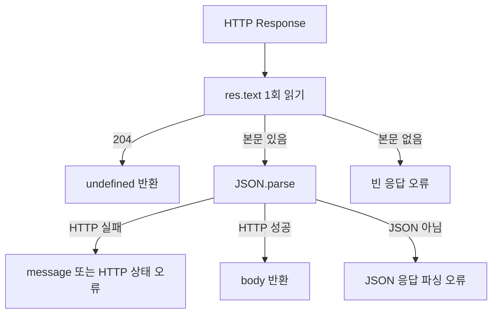
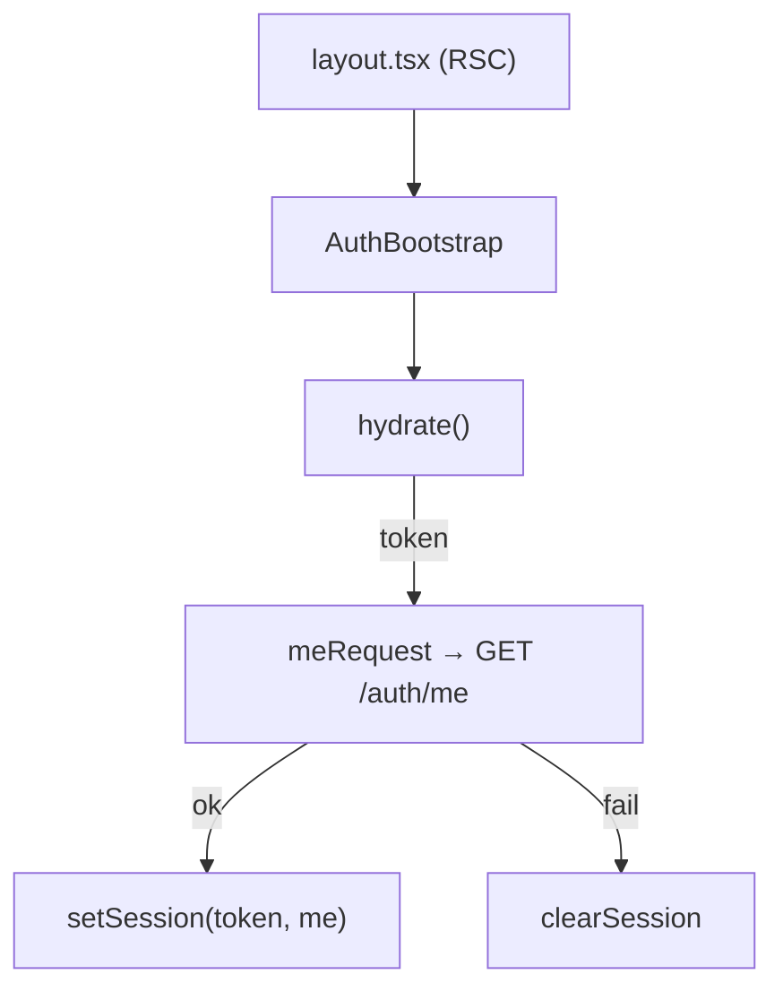
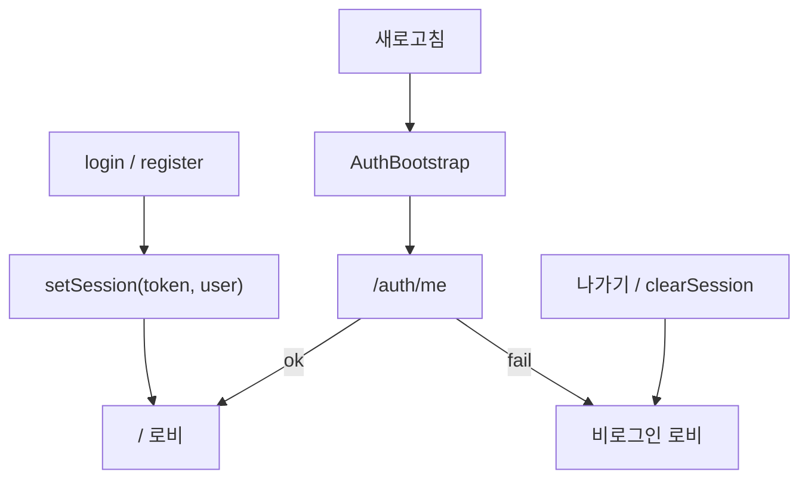

# Web Auth

관련 코드:

```txt
apps/api/src/auth/                     register · login · me · check-email · check-nickname
apps/api/src/auth/jwt-auth.guard.ts    Public이어도 JWT 시도 (OptionalUserId용)
apps/api/src/auth/decorators/          public · user-id · optional-user-id
apps/web/lib/api.ts
apps/web/lib/auth-api.ts
apps/web/lib/auth-store.ts
apps/web/hooks/useAvailabilityCheck.ts
apps/web/components/auth/AuthBootstrap.tsx
apps/web/app/layout.tsx                ← AuthBootstrap
apps/web/app/(auth)/layout.tsx         ← 매표 창구 셸
apps/web/app/(auth)/login/page.tsx
apps/web/app/(auth)/register/page.tsx
```

서버 목록 데이터(티켓·포스터)는 여기 두지 않는다 → `state.md` (TanStack Query).

---

## API 응답 규칙

| 엔드포인트 | 응답 |
|--|--|
| `POST /v1/auth/register` | `{ accessToken, user, message }` |
| `POST /v1/auth/login` | `{ accessToken, user, message }` |
| `GET /v1/auth/me` | **유저 객체만** `{ id, email, nickname, role, avatarConfig }` |
| `GET /v1/auth/check-email?email=` | `{ available: boolean }` |
| `GET /v1/auth/check-nickname?nickname=` | `{ available: boolean }` |

```txt
함정: me를 login과 같이 buildAuthResponse로 감싸면
  Bootstrap이 통째로 setSession(..., me) → user.nickname = undefined
  (실제 닉네임은 me.user.nickname)
me는 프로필만 반환한다.
```

`available: true` = 사용 가능, `false` = 비었거나 이미 존재.  
이메일 조회 전 `trim().toLowerCase()`, 닉네임은 `trim()`만.  
서비스 내부는 `isAvailable(where)`로 공유.

`@Public`: register · login · check-email · check-nickname · health · **GET /review-posts** · **POST /anon/visit**.

---

## Public + 선택적 로그인 (`OptionalUserId`)

후기 **목록은 공개**인데, 로그인했으면 **내가 누른 하트(`likedByMe`)**도 같이 내려줘야 함.

| | |
|--|--|
| `@UserId()` | 토큰 없으면 **401** — create/like/patch/delete용 |
| `@OptionalUserId()` | 토큰 있으면 `userId`, 없으면 `undefined` — **공개 list용** |

`@UserId()`만 쓰면 비로그인 list가 깨짐.  
그래서 `optional-user-id.decorator.ts`를 둠.

```txt
apps/api/src/auth/decorators/user-id.decorator.ts
apps/api/src/auth/decorators/optional-user-id.decorator.ts
apps/api/src/auth/jwt-auth.guard.ts
```

### JwtAuthGuard — Public에서도 JWT 시도

예전: `@Public`이면 guard가 **바로 true** → `request.user` 비어 있음.  
지금: Public이어도 `super.canActivate`로 JWT 검증 **시도**, 실패해도 Public이면 통과.

```txt
토큰 있음  → request.user.sub 채움 → OptionalUserId가 id 반환
토큰 없음/깨짐 → Public이면 통과 · user 없음 → likedByMe=false
비Public + 실패 → 401
```

웹: `listReviewPostsRequest(limit, accessToken?)`로 Bearer 전달.  
후기방 UI → [review.md](./review.md)

---

## 1. `apiFetch` (`lib/api.ts`)

```txt
base = NEXT_PUBLIC_API_URL (기본 http://localhost:3050)
URL  = ${API_URL}/v1${path}   ← path는 /로 시작 (/auth/login)
token 옵션 → Authorization: Bearer …
204 No Content → undefined (delete용)
```

배포 환경에서는 `NEXT_PUBLIC_API_URL`에 Railway API origin을 넣음. 이 값은 `NEXT_PUBLIC_` 규칙상 브라우저에 공개되므로 Vercel에서는 `Config` 유형을 사용함. `https://api.example.com/v1`처럼 `/v1`까지 넣지 않음.

### 응답 처리 순서

`apiFetch`는 응답을 바로 `res.json()`으로 읽지 않고 먼저 `res.text()`로 한 번만 읽는다. 빈 응답이나 JSON이 아닌 응답에서도 원인을 확인할 수 있도록 하기 위함이다.



처리 규칙:

| 조건 | 처리 |
|--|--|
| `204 No Content` | `undefined` 반환 |
| `2xx` + JSON 본문 | 파싱한 `body` 반환 |
| `2xx` + 빈 본문 | 콘솔에 URL·상태·content-type 기록 후 `빈 응답` 오류 |
| `4xx/5xx` + JSON 본문 | 응답의 `message`를 우선 사용해 예외 발생 |
| JSON 파싱 실패 | 상태 코드와 응답 앞 200자를 포함해 예외 발생 |

예를 들어 Railway API가 `500`과 `{ message: '데이터베이스 오류가 발생했습니다.' }`를 반환하면 웹에는 해당 메시지가 표시된다. 반대로 `200`인데 본문이 비어 있으면 성공으로 삼지 않고 `[apiFetch] 성공했지만 빈 응답` 로그를 남긴다.

`res.json()`을 여러 번 호출하면 Response body가 이미 소비되어 `Unexpected end of JSON input` 또는 body 사용 오류가 발생하므로, 응답 본문은 반드시 한 번만 읽는다.

### `200 OK`인데 빈 응답이 나오는 경우

NestJS controller가 `null`을 그대로 반환하면 HTTP 상태는 `200`이어도 실제 response body가 비어 보일 수 있다.

```txt
API:  return null
Web:  status=200 · raw=''
      → [apiFetch] 성공했지만 빈 응답
```

조회 결과가 없는 정상 상태도 JSON 객체로 감싸서 반환함.

```ts
// 나쁜 응답
return report;

// 좋은 응답
return { report };
```

Web helper는 래퍼를 해제한 뒤 화면에 전달함.

```ts
const response = await apiFetch<{ report: Report | null }>(path, { token });
return response.report;
```

`null` 자체를 전송해야 하는 endpoint라면 `204 No Content`를 명시적으로 사용하고, 호출부도 `undefined`를 정상 상태로 처리해야 함. JSON 조회 endpoint에서는 `{ data: null }` 또는 `{ report: null }` 방식이 디버깅에 유리함.

### JSON API와 파일 다운로드 API 구분

`apiFetch`는 JSON 응답 전용임. Excel·CSV·이미지처럼 binary body를 반환하는 endpoint에 `apiFetch`를 사용하면 JSON 파싱 오류가 발생함.

```txt
JSON API       apiFetch → res.text() → JSON.parse
Excel download fetch → response.blob() → URL.createObjectURL → download
```

Excel 리포트:

```txt
GET  /v1/admin/reports/daily-excel/status  → JSON
GET  /v1/admin/reports/daily-excel        → xlsx binary
POST /v1/admin/reports/daily-excel/cron   → xlsx binary · x-cron-secret
```

상태 조회는 `apiFetch`, 파일 다운로드는 별도 `fetch` helper를 사용함.

### API 오류를 읽는 순서

브라우저 콘솔의 `apiFetch` 오류는 화면 문제가 아니라 **HTTP 응답의 상태·본문·형식**을 먼저 확인해야 함.

| 로그·상태 | 의미 | 먼저 확인할 곳 |
|---|---|---|
| `401 Unauthorized` | 인증 토큰 또는 cron secret 불일치 | JWT가 필요한 endpoint인지, `Authorization`·`x-cron-secret` 전달 여부 |
| `500 데이터베이스 오류` | API는 응답했지만 DB 조회·저장 실패 | Railway API 로그, `DATABASE_URL`, Prisma migration 적용 여부 |
| `502 Application failed to respond` | Railway 프록시가 앱의 정상 응답을 받지 못함 | Railway deploy log, `PORT` 환경 변수, 앱이 `0.0.0.0`에 listen하는지 |
| `200 + 빈 응답` | controller가 `null`을 직접 반환했거나 응답 body가 없음 | controller 반환값을 `{ report: null }` 형태로 감쌌는지 |
| `Unexpected end of JSON input` | 빈 응답을 JSON으로 파싱하려고 함 | `apiFetch` 호출 endpoint가 JSON인지, `res.text()` 로그의 raw body |
| `Cannot read properties of undefined` | API 응답 필드명·nullable 처리 불일치 | DTO/응답 타입과 실제 JSON key 비교, `?.`·기본값 처리 |
| `NaN% (undefined/undefined)` | 진행률 계산에 필요한 숫자 필드가 없음 | API JSON 실제 필드, 진행 중·완료·실패 상태별 응답 계약 |

#### 재현 순서

```txt
1. 브라우저 Network에서 Request URL·Status·Response 확인
2. API 로그에서 같은 시각의 요청 로그 확인
3. JSON endpoint인지 binary endpoint인지 구분
4. controller 반환값과 web helper의 unwrap 위치 비교
5. Railway라면 PORT·DATABASE_URL·CRON_SECRET 확인
```

`apiFetch`에 `status=200`, `contentType=null`, `raw=''`가 함께 찍히면 프론트 JSON 파서가 고장난 것이 아니라 서버가 빈 body를 보낸 것임. 먼저 controller의 반환값을 확인함.

`502`는 API 비즈니스 로직의 `throw`와 구분해야 함. Railway 컨테이너가 시작 로그를 남겼더라도 지정된 `PORT`를 등록하지 않았거나 외부 요청을 받을 주소로 listen하지 않으면 프록시 단계에서 `502`가 발생할 수 있음.

`401`은 GitHub Actions가 Railway에 도달하지 못한 오류가 아님. 요청은 API까지 도착했지만 `CRON_SECRET` 또는 관리자 JWT 검증에서 거절된 것임.

`500`은 화면에서 재시도하기 전에 Railway 로그의 원인과 DB 스키마 상태를 확인함. Prisma schema를 바꾼 뒤 migration을 배포하지 않으면 존재하지 않는 테이블·컬럼 조회에서 발생할 수 있음.

> [!warning] 응답 타입은 서버 JSON과 일치해야 함
> `getDailyExcelStatusRequest`는 서버 응답 `{ report: AdminDailyReportStatus | null }`를 받은 뒤 `response.report`만 반환함. 서버가 `{ report }`를 반환하는데 Web 타입을 `AdminDailyReportStatus`로 선언하면 `report.status` 대신 `report.report.status`를 읽게 되어 `undefined` 오류로 이어짐.

### KST 날짜 함수 분리

API와 Web의 `date-kst.ts`는 같은 이름의 파일이지만 책임이 다름.

| 위치 | 역할 |
|---|---|
| `apps/api/src/lib/date-kst.ts` | Prisma `@db.Date`, DB 조회 구간 `[start, end)`, 집계 시간, Excel timestamp |
| `apps/web/lib/date-kst.ts` | 화면 제목용 `2026년 8월 24일 월요일`, 로비 날짜 라벨, 지난 날짜 표시 |

API의 `formatKst`는 Excel·로그에 넣을 시각 문자열용이고, Web의 `formatKstDateKey`는 화면 표시용임. 같은 기능을 양쪽에서 import하지 않고 실행 환경별 helper로 유지함.

---

## 2. `auth-api` (`lib/auth-api.ts`)

페이지는 UI만. HTTP는 여기.

```ts
loginRequest(email, password)                 → AuthResponse
registerRequest(email, password, nickname)    → AuthResponse
meRequest(token)                              → AuthUser
updateAvatarRequest(token, AvatarConfig)      → AuthUser
updateProfileRequest(token, UpdateProfileInput) → AuthUser
getPublicProfileRequest(nickname)             → PublicProfile
checkEmailRequest(email)                      → { available }
checkNicknameRequest(nickname)                → { available }
```

`AuthResponse.user` ≈ `AuthUser` (id · email · nickname · role · avatarConfig · **bio · profilePublic · tags**).  
아바타 → [avatar.md](./avatar.md) · 프로필 → [profile.md](./profile.md)

---

## 3. `auth-store` (Zustand + localStorage)

| 무엇을 | 어디 | 새로고침 |
|--|--|--|
| `accessToken` | 메모리 + localStorage (`cinemo_access_token`) | 유지 |
| `user` | 메모리만 | `/auth/me`로 복구 |

```txt
setSession(token, user)  login/register/me 성공
setUser(user)            avatar PATCH 등 user만 갱신
clearSession()           logout · me 실패
hydrate()                localStorage → accessToken 읽고 hydrated: true
hydrated                 guard가 "아직 로딩 중"과 "진짜 비로그인"을 구분할 때 씀
```

XSS에 토큰 노출 가능. 이후 Access 메모리 + Refresh httpOnly로 바꿀 수 있음.

---

## 4. `AuthBootstrap`

`layout.tsx`는 RSC → `useEffect`/Zustand를 못 씀 → 클라이언트 래퍼.



async 클로저에서 `accessToken` narrowing이 풀리므로:

```ts
if (!accessToken) return;
const token = accessToken;
```

---

## 5. 회원가입 실시간 검사

`useAvailabilityCheck` — 이메일·닉네임 공통.  
코드: `apps/web/hooks/useAvailabilityCheck.ts`

### Options

| 인자 | 뜻 |
|--|--|
| `value` | input에 묶인 문자열 (이메일 또는 닉네임 state) |
| `validate` | **API 치기 전** 형식 검사. `true`면 통과, `false`면 `invalid` (서버 안 감). 예: 이메일 정규식, 닉네임 2~20자 |
| `check` | 서버 호출 함수. `checkEmailRequest` / `checkNicknameRequest` → `{ available }` |
| `delayMs` | debounce. 기본 400. 타이핑 멈춘 뒤에만 요청 |

```txt
validate ≠ 중복 검사
  validate = “형식이 맞나?” (로컬)
  check    = “이미 쓰이나?” (서버)
```

`validate` / `check`는 훅 deps에 넣지 않고 **ref**로 최신 함수만 읽음.  
→ 매 렌더 새 화살표를 넘겨도 effect가 값 바뀔 때만 돈다.

### 상태 (`AvailabilityCheckStatus`)

| 상태 | 뜻 | UI 예 |
|--|--|--|
| `idle` | 아직/대기. 비어 있거나, debounce 대기 중, 또는 요청 실패 후 | 힌트 없음 |
| `checking` | debounce 끝 → API 호출 중 | 확인 중… |
| `ok` | `available: true` 사용 가능 | 사용 가능한 … |
| `taken` | `available: false` 이미 존재 | 이미 사용중인 … |
| `invalid` | `validate` 실패 (형식/길이) | 형식을 확인해 주세요 / 2~20자 |

```txt
흐름:
  value trim
  → 빈 값        → idle
  → validate 실패 → invalid
  → idle (debounce 대기) → checking → check API
  → available ? ok : taken
```

비밀번호 규칙(현재): **8자 이상** (`MinLength(8)` · 라벨 옆 힌트).  
영문+숫자+특수문자는 나중에 DTO `@Matches` + 프론트 규칙 확장.

서버 에러 배너: 폼 **상단** (`role="alert"`). 필드 힌트는 해당 input 아래.

---

## 6. Auth UI

```txt
라우트 그룹 (auth) — URL은 /login · /register
Zod v4 + react-hook-form + zodResolver
성공 → setSession → router.push(next || role=admin ? '/admin' : '/')
비밀번호 보기: lucide-react Eye / EyeOff (필드별 독립 토글)
아이콘: Lucide (Font Awesome 대신)
```

| 페이지 | 비고 |
|--|--|
| `/register` | 이메일·닉네임 실시간 중복 · 비밀번호 확인 · `*` 필수 표시 |
| `/login` | Google·Naver OAuth · Apple/Kakao 자리(disabled) · 이메일 폼 |

소셜은 **로그인**에만. 회원가입에는 두지 않음.  
무드: **불 꺼진 매표 창구** (어두운 셸 · 골드 포인트 · 밑줄 인풋).  
Chrome autofill 파란 배경은 `-webkit-autofill`로 다크 톤 덮음.

---

## 7. 세션 흐름



로비 조명과의 연결 → [lobby.md](./lobby.md)

---

## 8. 비로그인 guard

로그인이 필요한 페이지는 `hydrated` 확인 후 redirect.

```txt
/gacha · /cafe · /cafe/[tableId]
/my-cinema · /my-cinema/wish · /my-cinema/watched (MovieShelf 공통)

hydrated: false   → 아직 hydrate 전 · 기다림
hydrated: true, accessToken: null → router.replace('/login?next=<path>')
```

`hydrated`가 없으면 서버 SSR 직후 `accessToken: null`인 순간에 로그인한 사람도 튕김.  
`/review`는 비로그인도 볼 수 있으므로 guard 없음 (쓰기 시도는 별도 모달).  
`AdminGate`는 별도 guard → [admin.md](./admin.md)

---

## 9. Admin (`role`)

가드·페이지 → [admin.md](./admin.md)

```txt
register / login 응답에 role
register → 항상 user · 로그인 횟수 안 셈
login 손님 → AdminLoginLog + daily/hourly logins
login admin → 집계 skip · 홈에서 /admin
첫 admin → DB UPDATE 후 재로그인
API → @Roles('admin') + RolesGuard (JwtAuthGuard 다음)
Web → AdminGate · role !== admin → /
UI만 숨기기 ❌
```

---

## 10. Google OAuth와 일회용 로그인 code

현재 Google 로그인은 access token을 브라우저 URL에 직접 넣지 않고, 짧은 시간 동안 한 번만 사용할 수 있는 code를 발급한 뒤 Web이 API에서 교환하는 방식임.

```mermaid
flowchart LR
  Login[로그인 화면] --> Google[Google OAuth 시작]
  Google --> Callback[GET /v1/auth/google/callback]
  Callback --> Profile[Google profile 검증]
  Profile --> User[사용자 조회·생성 또는 SocialAccount 연결]
  User --> Code[OAuthLoginCode 생성 · 60초 만료]
  Code --> WebCallback[/auth/callback?code=...]
  WebCallback --> Exchange[POST /v1/auth/google/exchange]
  Exchange --> Consume[code 원자적 소비]
  Consume --> Token[accessToken + user 반환]
  Token --> Session[setSession · 최근 로그인 방식 저장]
  Session --> Lobby[로비 또는 관리자 화면]
```

### 왜 access token을 redirect URL에 넣지 않는가

`/auth/callback?accessToken=...`처럼 토큰을 URL에 넣으면 브라우저 방문 기록·서버 로그·프록시 로그·분석 도구·Referer에 노출될 가능성이 있음. 현재 URL에는 짧은 수명의 일회용 code만 둠.

```txt
Google callback
  → API가 사용자 조회·생성
  → OAuthLoginCode 원문 생성
  → DB에는 codeHash만 저장
  → Web /auth/callback?code=... 로 redirect
  → Web이 API에 code 교환 요청
  → API가 code를 원자적으로 consumed 처리
  → accessToken + user 반환
```

### API 책임

| 위치 | 책임 |
|--|--|
| `apps/api/src/auth/auth.controller.ts` | Google callback, 일회용 code 교환 endpoint |
| `apps/api/src/auth/auth.service.ts` | 사용자 조회·생성, code hash 저장·검증·소비, JWT 발급 |
| `apps/api/src/auth/dto/exchange-oauth-code.dto.ts` | 교환 code의 문자열·최소 길이 검증 |
| `apps/api/prisma/schema.prisma` | `SocialAccount`, `OAuthLoginCode`, `lastLoginProvider` 모델 기준 |

주요 endpoint:

```txt
GET  /v1/auth/google
GET  /v1/auth/google/callback
POST /v1/auth/google/exchange
```

### `OAuthLoginCode` 보안 규칙

- 원문 code는 `randomBytes(...).toString('base64url')`로 생성함
- DB에는 SHA-256 hash만 저장하고 원문은 redirect 시점에만 사용함
- 만료 시간은 현재 60초임
- 교환 성공 시 `consumedAt`을 기록함
- `consumedAt IS NULL`과 `expiresAt > now` 조건을 포함한 원자적 update로 중복 교환을 막음
- 만료·이미 사용·존재하지 않는 code는 같은 인증 오류로 처리해 code 존재 여부를 노출하지 않음
- callback URL을 새로고침하거나 뒤로 가기로 재방문하면 같은 code를 재사용할 수 없음

```txt
OAuthLoginCode
├─ id
├─ userId
├─ codeHash (unique)
├─ expiresAt
├─ consumedAt (nullable)
└─ createdAt
```

### Prisma 변경

소셜 계정과 일회용 code를 위해 다음 구조를 사용함.

```txt
User.lastLoginProvider: email | google | naver | kakao | apple | null
SocialAccount: provider + providerAccountId unique
OAuthLoginCode: codeHash unique · expiresAt · consumedAt · user relation
```

스키마를 바꾼 뒤에는 Client 생성과 migration 적용이 별도임.

```bash
pnpm --filter api exec prisma generate --schema prisma/schema.prisma
pnpm --filter api exec prisma migrate dev --name add_oauth_login_codes --schema prisma/schema.prisma
pnpm --filter api exec prisma migrate deploy
```

운영 배포에서는 Railway build의 `prisma generate`만으로 테이블이 생성되지 않으므로, 같은 운영 `DATABASE_URL`에 `prisma migrate deploy`가 적용되어야 함.

### Web callback 책임

`apps/web/app/auth/callback/page.tsx`는 다음 순서로 동작함.

```txt
1. searchParams에서 code 추출
2. 같은 code에 대한 교환 Promise를 ref로 공유
3. POST /auth/google/exchange 호출
4. null 응답을 명시적으로 거절
5. setSession(accessToken, user)
6. localStorage에 cinemo_recent_login_provider 저장
7. admin이면 /admin, 아니면 / 로 이동
```

React Strict Mode 개발 환경에서는 effect가 mount → cleanup → mount로 실행될 수 있음. 첫 effect의 취소 플래그만으로 요청을 제어하면 API에서 code가 소비된 뒤 화면은 계속 `로그인 처리 중…`에 머무를 수 있음. 따라서 현재는 교환 Promise 자체를 ref에 공유하고, 두 번째 effect에서도 같은 결과를 받을 수 있게 처리함.

`localStorage`의 `cinemo_recent_login_provider`는 최근 로그인 UI를 위한 브라우저 힌트일 뿐임. 토큰·비밀번호를 저장하지 않음. DB의 `User.lastLoginProvider`는 계정의 마지막 로그인 방식을 나타내는 서버 값임.

---

## 11. 실제로 겪은 인증 오류와 원인

| 오류·증상 | 원인 | 해결·재현 시 주의 |
|--|--|--|
| `EADDRINUSE: address already in use :::3050` | API를 이미 실행 중인데 두 번째 Nest 서버를 시작함 | 기존 프로세스를 확인하고 하나만 실행함. `lsof -nP -iTCP:3050 -sTCP:LISTEN` 후 확인된 PID만 종료함 |
| `OAuth code가 만료되었거나 이미 사용되었습니다.` | Google code는 짧은 수명의 일회용 값이라 새로고침·재요청·중복 교환할 수 없음 | callback URL을 재사용하지 말고 로그인 화면에서 Google 로그인을 새로 시작함 |
| Google에서 `invalid_grant` | Google authorization code가 만료되었거나 이미 교환됨 | 같은 code를 다시 보내지 않음. redirect URI와 client 설정도 함께 확인함 |
| `로그인 처리 중…`에서 멈춤 | API 3050이 꺼졌거나, Strict Mode에서 첫 callback 요청이 취소되어 API만 code를 소비함 | API 실행 상태를 확인하고 Web callback의 공유 Promise 처리를 유지함 |
| 오류 없이 다시 `/login`으로 이동 | callback의 catch에서 실제 오류를 숨기고 로그인 화면으로만 이동하던 상태 | callback 화면에 `role="alert"`로 API 오류를 표시함 |
| `auth is possibly null` | API 응답 타입이 nullable인데 바로 `auth.accessToken`을 읽음 | `if (!auth) throw new Error(...)`로 null을 먼저 차단함 |
| API 시작 시 소셜 환경 변수 검증 실패 | 아직 설정하지 않은 Naver·Kakao·Apple 키를 필수로 검증함 | 미도입 provider는 `optional().allow('')`로 두고 실제 연동 시 필수 검증을 다시 정의함 |
| Prisma `P3015` — `migration.sql`을 찾을 수 없음 | migration 디렉터리만 있고 파일이 없거나 손상됨 | 디렉터리를 무작정 삭제하지 말고 Git에서 `migration.sql`을 복구하거나, 적용 이력을 확인한 뒤 깨진 디렉터리를 정리하고 migration을 다시 생성함 |
| `@cinemo/shared`를 찾을 수 없음 | Vercel이 monorepo workspace 의존성 또는 패키지 빌드 설정을 해석하지 못함 | `pnpm-workspace.yaml`, package name, Vercel Root Directory·Install Command·Build Command와 lockfile을 함께 확인함 |
| callback에서 API 연결 실패 | Web은 3051, API는 3050인데 API가 실행되지 않았거나 `NEXT_PUBLIC_API_URL`이 다른 주소를 가리킴 | `NEXT_PUBLIC_API_URL`, API `PORT`, `FRONTEND_URL`, Google redirect URI, CORS origin을 같은 환경 기준으로 맞춤 |
| `NaverStrategy` 타입 선언 오류(`TS2742`) | `passport-naver-v2`의 OAuth2 타입이 declaration 생성 시 외부 타입 경계를 노출함 | `PassportStrategy(Strategy as any, 'naver')`로 전략 생성자 타입 경계를 명시적으로 차단하고, `validate` 반환 타입은 `SocialProfile`로 고정함 |
| `No projects matched the filters` | 실제 workspace package 이름이 `@repo/api`가 아니라 `api`임 | 패키지 설치·스크립트 실행 시 `--filter api`를 사용함 |
| 네이버 로그인 후 최근 로그인 배지가 Google로 표시됨 | 소셜 로그인 서비스가 provider를 고정값 `google`으로 저장함 | `lastLoginProvider: profile.provider`로 저장해 Google·Naver 값을 실제 로그인 provider와 일치시킴 |
| 카카오 callback에서 이메일 동의 필요 401 | Kakao Developer 설정에서 `카카오계정(이메일)` 권한이 `권한 없음`이고 `User.email`은 필수임 | 사업자·비즈 앱 권한을 준비하기 전까지 Kakao OAuth는 보류함. 닉네임만으로 우회하지 않음 |

### OAuth 오류를 확인하는 순서

```txt
1. Google 로그인은 callback URL을 복사·새로고침하지 않고 새 흐름으로 재시도
2. Web Network에서 POST /v1/auth/google/exchange의 상태·응답 확인
3. API 로그에서 code 만료·소비·DB 오류 확인
4. API가 3050에서 실행 중인지 확인
5. FRONTEND_URL·Google callback URL·NEXT_PUBLIC_API_URL·CORS origin 비교
6. schema 변경 후 Prisma migration과 generate가 모두 실행됐는지 확인
```

---

## 12. 현재 상태와 남은 확인 사항

- Google OAuth와 일회용 code 교환은 구현되어 있음
- 이메일 로그인은 Zod v4 + react-hook-form을 사용함
- 최근 로그인 방식은 DB `lastLoginProvider`와 Web `localStorage`로 표시할 준비가 되어 있음
- Google OAuth와 Naver OAuth는 완료함. Naver는 `passport-naver-v2`, callback, 공통 소셜 로그인, `lastLoginProvider` 반영까지 포함함
- Kakao OAuth는 이메일 제공 권한 문제로 보류함. Kakao 이메일 권한 없이 현재 `User.email` 필수 구조를 안전하게 통과시키지 않음
- Apple OAuth는 Apple Developer Program 연회비와 Services ID·Sign in with Apple Key 설정이 필요해 보류함
- PASS 본인인증과 SMS OTP는 사업자·비용·rate limit 검토 후 도입하기로 보류함 → [auth-recovery.md](./auth-recovery.md)
- 비밀번호 찾기 메일 발송과 `requestPasswordReset`은 실제 메일 서비스 선택 전까지 보류함
- 이메일 로그인 service에서 `lastLoginProvider`를 갱신한 결과를 최종 응답에 사용하는지 확인 필요함. 갱신 전 `user`를 반환하면 응답의 `lastLoginProvider`가 이전 값으로 남을 수 있음
- 계정 설정·이메일 확인·연결된 소셜 계정 해제·회원 탈퇴는 인증 기본 흐름 안정화 후 진행함

인증 관련 폼 규칙 → [forms.md](./forms.md)  
계정 복구 설계 → [auth-recovery.md](./auth-recovery.md)  
Prisma 현재 모델 → [../prisma/current-model.md](../prisma/current-model.md)
