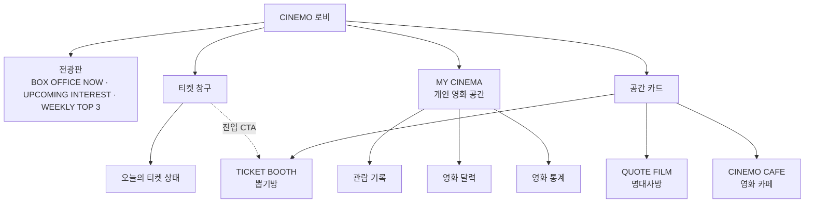

# Web Lobby

코드:

```txt
apps/web/app/page.tsx
apps/web/app/styles/lobby.css            (.lobby* · .ticket-stub*)
apps/web/components/lobby/LobbyBoard.tsx
apps/web/components/lobby/TicketBooth.tsx
apps/web/components/lobby/Staff.tsx
apps/web/components/lobby/GuestFigure.tsx
apps/web/lib/lobby-speech.ts
apps/web/lib/lobby-board-api.ts
apps/web/lib/ticket-api.ts
apps/web/lib/date-kst.ts                 kstLobbyDateLabel
```

로비는 **메뉴 리스트·하단 탭바가 아니라 한 화면 공간**.  
계층(상태 → 안내 → 행동 → 나)은 살리고, 배치만 영화관 로비로.

티켓 → [ticket.md](./ticket.md) · 세션 → [auth.md](./auth.md) · 전광판 → [board.md](./board.md) · 명대사 → [quote.md](./quote.md) · 사운드 → [sound.md](./sound.md)

개봉 예정 영화 목록과 관심 등록 → [upcoming.md](./upcoming.md)

---


## 로비 연결 구조




- 티켓 창구는 티켓 상태와 뽑기방 진입을 연결하는 로비의 의식적 장치임
- 뽑기방은 공간 카드에서도 바로 접근 가능함
- MY CINEMA는 개인 기록·달력·통계를 모아두는 별도 공간임

---


## 전광판 순위 전환

전광판은 여러 통계 카드를 동시에 나열하지 않고 영화관 전광판 안에서 순위를 전환하는 구조로 정리함.

- BOX OFFICE NOW: KOBIS 전날 일일 박스오피스의 누적 관객 수
- UPCOMING INTEREST: CINEMO 사용자의 찜 수 기준 개봉 예정작 TOP 5
- WEEKLY TOP 3: 이번 주 CINEMO 후기 작성 수 기준 영화 TOP 3
- 기본 탭은 WEEKLY TOP 3로 표시함
- `UPCOMING INTEREST`와 `/upcoming` 목록은 같은 개봉 예정 영화 조회 결과를 사용함
- `/upcoming`은 전체·현재 월·다음 월·다다음 월·다음 연도 필터와 10개 단위 더 보기를 제공함
- 상세 보기에서는 개봉일·장르·감독·주요 배우·예고편·보고 싶어요 상태를 확인함
- TMDB 1~3페이지와 `MoviePool`의 유효한 예정작을 `tmdbId` 기준으로 합침
- 한국어 제목이 없거나 포스터가 없는 영화는 개봉 예정 목록에서 제외함
- 관심 수는 `UserMovie(kind=wish)`를 영화별로 집계함
- KOBIS의 audiAcc를 사용해 전날 하루 관객 수가 아닌 누적 관객 수를 표시함
- KOBIS 요청은 서버 메모리에 같은 날짜 기준 10분 캐시함
- 외부 API 실패 시 기존 캐시가 있으면 캐시를 반환하고, 없으면 빈 상태를 표시함
- 순위 변동은 박스오피스 탭에서만 표시함
- 긴 제목은 한 줄 말줄임, 관객 수는 축약 표기함
- 로딩 중에는 회전 아이콘과 통계 로딩 문구를 표시함


## 첫 화면 구성 (100dvh 한 장)

```txt
┌─────────────────────────────────────┐
│         [조명]    [조명]              │  ← 로그인 ON
│            CINEMO                    │
│   2026년 8월 14일 · 금 · 16:12       │  ← KST 마퀴 (연·요일·시분)
│  ┌── 전광판 순위 탭 ──────────────┐ │
│  │ [BOX][UPCOMING][WEEKLY]        │ │
│  │  순위 · 제목 · 막대 · 수치      │ │
│  └────────────────────────────────┘ │
│                                     │
│       직원 + 레트로 티켓 창구         │
│                                     │
│          [나] + MY CINEMA             │
│                                     │
│     [TICKET] [QUOTE] [CAFE]          │
│      뽑기방   명대사방  영화 카페      │
└─────────────────────────────────────┘
```

- 키커 「전광판 분석」 ❌
- 세로: `overflow: hidden` · gap으로 숨 쉬게


### 계층 → 공간


| 계층            | 자리                                                 |
| ------------- | -------------------------------------------------- |
| 브랜드 · 날짜      | CINEMO · 아래 KST 마퀴                                 |
| 상태 요약         | 전광판 3칸 · viz↑ + 라벨·N↓ **블록 분리**                    |
| NPC           | Staff 말풍선 · **클릭만 발급**                             |
| 티켓 · 뽑기       | 중앙 창구=티켓 상태 · 공간 카드에서 뽑기방 이동                       |
| 뽑기 · 명대사 · 카페 | 같은 계열의 공간 카드 3개로 이동                                |
| 나             | 티켓 창구 아래 사용자 정보 · MY CINEMA / admin: CINEMO OFFICE |


명대사 공간 연결:

```txt
로비 공간 카드
  · roomId: LOBBY_ROOMS.QUOTE_FILM
  · 라벨: QUOTE FILM · 명대사방
  · 이동: /quote

/quote
  · 공개 명대사 필름 카드
  · 로그인 사용자는 명대사 추가 가능
  · /my-cinema/quotes에서 저장한 명대사 모음집 확인
```

### 개봉 예정 영화 진입

```txt
CINEMO 로비
  └─ 「곧 스크린에서 만날 영화」 → /upcoming
       ├─ CINEMO LOBBY → /
       └─ 찜한 영화 → /my-cinema/wish
```

`/upcoming`에서는 개봉일·관심 등록 수·보고 싶어요 상태를 확인할 수 있음. 로그인하지 않은 상태에서 보고 싶어요를 누르면 로그인 후 원래 페이지로 돌아가도록 이동함.

---


## 날짜 (KST)

```txt
위치: CINEMO ↔ 전광판 사이
형식: kstLobbyDateLabel → `2026년 8월 14일 · 금 · 16:12`
톤: 마퀴 타이포 (달력 위젯 ❌)
클릭: 없음

초기 렌더링 때 한 번만 시간을 계산하면 화면 시간이 멈춰 새로고침해야 바뀌는 문제가 생김. `LobbyBoard`는 초기값을 즉시 표시한 뒤 `setInterval`로 1분마다 `kstLobbyDateLabel()`을 다시 계산함.

```txt
마운트 → 현재 KST 시간 즉시 표시
       → 60초마다 시간 갱신
언마운트 → interval 정리
```

브라우저 표시 시간과 날짜 기준은 계속 `Asia/Seoul`로 통일함.

```

티켓·전광판·후기의 “오늘”과 같은 Asia/Seoul 기준.

---
```


## 구역


| 구역         | 역할                                                     |
| ---------- | ------------------------------------------------------ |
| **조명**     | 브랜드 위 2개 · dim/lit                                     |
| **날짜**     | `.lobby-board-date` · `kstLobbyDateLabel`              |
| **전광판**    | 박스오피스·사용자 관심·주간 TOP 3 전환 · [board.md](./board.md)      |
| **Staff**  | 모자·볼터치 · `~` 톤 · 클릭=발급(비로그인→입장)                        |
| **데스크**    | 레트로 우드+브라스 · 입장/가입 · 힌트 · 상태 표시                        |
| **공간 카드**  | `/gacha` · `/quote` · `/cafe` · 아이콘+영문 kicker+가로 한글 이름 |
| **사용자 영역** | AvatarFigure · 닉네임 · MY CINEMA · 티켓 상태는 창구에서만 표시       |


## MY CINEMA 진입점

로비의 사용자 정보와 MY CINEMA 이동 카드는 시각적으로 분리함.

```txt
사용자 정보
  · AvatarFigure
  · 닉네임

MY CINEMA 카드
  · 관람 기록
  · 영화 달력
  · 영화 통계
  · 이동: /my-cinema
```

- 아바타·닉네임은 사용자 식별 영역으로만 사용함
- MY CINEMA은 독립된 카드형 링크로 표시함
- 큰 화면: 티켓 창구 옆에 배치
- 모바일: 티켓 창구 아래, 공간 카드 위에 배치
- 관련 클래스: `.lobby-guest-identity`, `.lobby-mat`, `.lobby-mat-description`
- 관리자일 때는 같은 위치에 `CINEMO OFFICE → /admin`을 표시함


## 티켓 창구·뽑기방 기획 결정 기록


### 처음 의도

- 로비에서 직원에게 티켓을 받고 뽑기방에 입장하는 영화관의 의식적인 흐름을 만들려 함
- 티켓을 단순한 숫자가 아니라 오늘의 뽑기방 이용권으로 보여주려 함
- 직원, 티켓 창구, 티켓 stub, 뽑기 CTA를 통해 로비의 분위기와 행동을 연결하려 함


### 고민한 지점

- 뽑은 뒤에 이어지는 행동이 부족하면 티켓 발급 자체가 장식처럼 느껴질 수 있음
- 뽑기 결과가 관람 기록·찜·명대사 같은 다음 행동으로 연결되지 않으면 뽑기의 필요성이 약해짐
- 직원, 말풍선, 티켓 상태, 티켓 stub, 뽑기 버튼을 모두 노출하면 실제 효용보다 UI가 커질 수 있음
- 매일 티켓을 받는 과정이 반복 사용자에게는 불필요한 단계나 피로로 느껴질 수 있음


### 현재 결정

> [!note] 현재 방향
> 뽑기방은 일단 유지하되, 티켓 창구 UI를 더 확장하지 않고 실제 사용 흐름을 먼저 확인함.

- 티켓 창구는 중앙 매표소에서 오늘의 이용 상태를 안내하는 진입 의식으로 유지함
- 뽑기방은 티켓 창구의 CTA와 공간 카드 양쪽에서 접근 가능하게 둠
- MY CINEMA에 잔여 티켓 보관함·상세 잔액 UI를 추가하는 것은 보류함
- 뽑기 결과 이후의 다음 행동이 설계되기 전까지 직원·말풍선·티켓 관련 UI를 더 늘리지 않음
- 티켓 창구를 없애기보다, 실제로 뽑기방 진입을 돕는지 확인한 뒤 축소 여부를 결정함


### 재검토 기준

- 티켓을 받은 사용자가 실제로 뽑기방으로 이동하는가
- 뽑기 결과가 관람 기록·찜·명대사 등 다음 행동으로 이어지는가
- 티켓을 받는 과정이 로비의 분위기를 강화하는가, 아니면 이동을 방해하는가
- 티켓 창구에 들어간 UI 복잡도만큼 사용자가 얻는 정보·행동 가치가 있는가

---


## 조명

```txt
비로그인 = OFF · lobby--dim
로그인   = ON  · lobby--lit
admin    = 로그인 후 /admin 으로 이동 · 로비 체류는 /?lobby=1
MY CINEMA 로그아웃 = clearSession → OFF
```


### 관리자 로비 모드

관리자는 일반 회원의 `MY CINEMA`을 사용하지 않는다. 로비에 머무르는 경우에도 운영자 역할을 유지하며, 하단 진입점은 `CINEMO OFFICE → /admin`으로 표시한다.

```txt
/                         admin 자동 이동 → /admin
/?lobby=1                 admin 자동 이동을 건너뛰고 로비 표시
CINEMO OFFICE             /admin
관리자 로비               /?lobby=1
관리자 TICKET             발급 UI·티켓 상태 조회 없음 · 운영 모드
관리자 캐릭터             ADMIN_AVATAR · 일반 회원 avatarConfig와 구분
관리자 로그아웃           /admin 사이드바에서 clearSession → /
```

`/`는 관리자 진입 가드가 작동하므로 관리자용 로비 링크는 반드시 `/?lobby=1`을 사용해야 한다.

---


## 말풍선


## 향후 MY CINEMA 티켓 잔여 공간

현재 로비에서는 티켓 상태를 중앙 티켓 창구에서만 표시한다.  
사용자 영역에 TICKET · 오늘 사용함을 중복해서 보여주지 않는다.

향후 MY CINEMA 안에 개인 이용 현황 공간을 추가할 예정임.

- 잔여 티켓은 서버의 실제 티켓 상태를 기준으로 표시
- 로비의 티켓 발급/사용 UI와 같은 API를 재사용
- 티켓 수량이 여러 장으로 확장될 때를 고려해 단일 숫자보다 TicketBalance 영역으로 설계
- 현재 구현 범위는 아님

```txt
직원 → staffSpeech
TICKET → guestTicketLabel
손님 말풍선 ❌ · 말풍선 옆 발급받기 ❌
관리자 Staff → `관리자님, 오늘도 운영 확인하러 오셨네요~`
```


| 상태       | 직원                      | TICKET       |
| -------- | ----------------------- | ------------ |
| 비로그인     | 어서 오세요~ 입장하시면 티켓 드릴게요   | 입장 전 · 티켓 없음 |
| `none`   | ○○님, 오늘 뽑기권 받아가세요~      | 아직 없음        |
| `issued` | ○○님, 뽑기방 문이 열려 있어요~     | 발급됨 · 뽑기 가능  |
| `used`   | ○○님, 오늘도 즐거우셨나요~        | 오늘 사용함       |
| `admin`  | 관리자님, 오늘도 운영 확인하러 오셨네요~ | 운영 모드        |


---


## 로비 가이드

회원가입 성공 직후 한 번 표시되는 온보딩 모달. /admin/guide에서 관리자가 단계별 안내를 수정한다.

가이드 단계는 고정된 GUIDE_STEPS의 body만 사용하는 구조가 아니다. API가 반환한 steps의 각 객체에서 Kicker·제목·본문을 모두 렌더링하며, 이전/다음 이동·점·진행 번호는 단계 배열 길이에 맞춰 동작한다. 기본값은 API 실패 또는 초기 DB 생성 시 DEFAULT_LOBBY_GUIDE_STEPS를 사용한다.

## 상호작용


| 요소             | 동작                                            |
| -------------- | --------------------------------------------- |
| 발급 (`none`)    | **직원 클릭만** → issue · stub                     |
| 데스크 힌트         | `직원을 눌러 티켓을 받아보세요`                            |
| 데스크 (`issued`) | `오늘 티켓 · 사용 가능` (이동은 문)                       |
| 데스크 (`used`)   | `오늘 티켓 · 사용 완료`                               |
| 뽑기             | 왼쪽 문 · stub CTA                               |
| 나가기            | MY CINEMA 로그아웃                                |
| 입장/가입          | 비로그인 데스크                                      |
| MY CINEMA      | `/my-cinema` · 비로그인 `/login`                  |
| admin 홈        | `role===admin` → `/admin` · 로비 버튼 `/?lobby=1` |
| admin 캐릭터      | `ADMIN_AVATAR` · 로비 전용 · MY CINEMA 없음         |
| admin 로그아웃     | `/admin` 사이드바 로그아웃 → `clearSession()` → `/`   |


### stub

```txt
issue 성공 → ~2.2초 / 바깥 / Escape
CTA 「뽑기하러 가기」 → /gacha
createPortal → document.body
```

---


## 컴포넌트

```txt
page.tsx       공간 · ticketStatus · WeeklyReveal · AvatarFigure
TicketBooth    Staff + 데스크 + stub
Staff          직원 + 말풍선
AvatarFigure   손님 피규어 (avatarConfig) · [avatar.md](./avatar.md)
GuestFigure    레거시 (로비 미사용)
lobby-speech   문자열
date-kst       kstLobbyDateLabel
```
