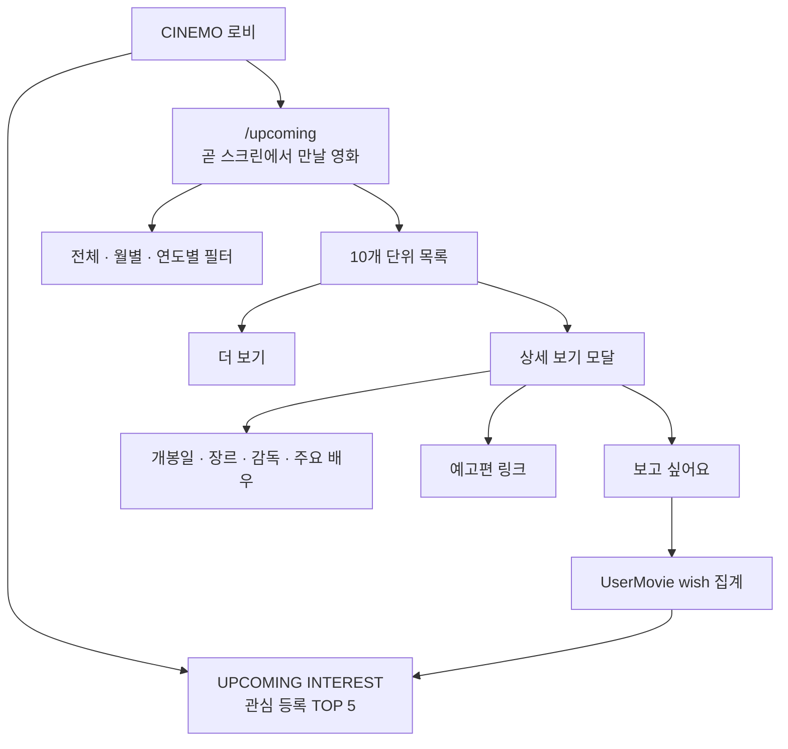
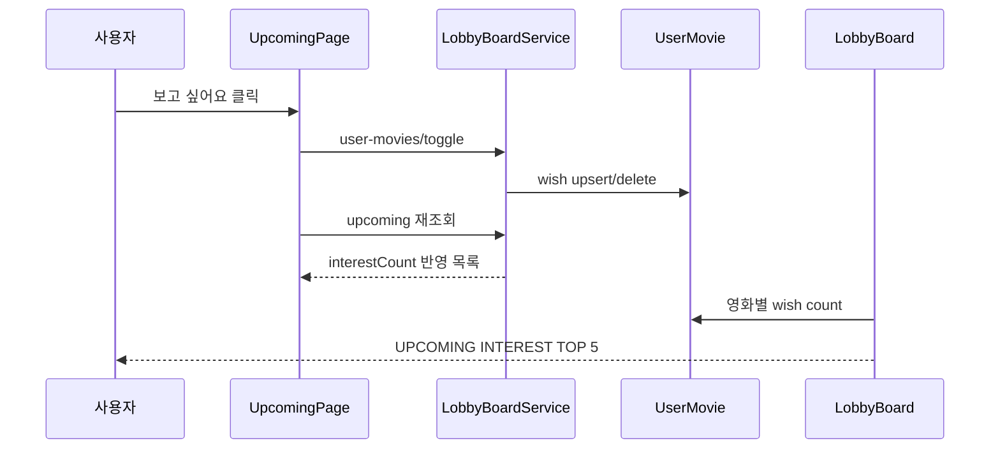

# UPCOMING · 곧 스크린에서 만날 영화

개봉 예정 영화를 확인하고, 관심 등록 수를 쌓아 `UPCOMING INTEREST` 순위로 연결하는 기능임.



## 연결 파일

```txt
apps/web/app/upcoming/page.tsx
apps/web/app/styles/upcoming.css
apps/web/app/styles/movie-detail-modal.css
apps/web/lib/lobby-board-api.ts
apps/web/lib/tmdb-api.ts
apps/web/components/my-cinema/MovieDetailModal.tsx
apps/api/src/lobby-board/lobby-board.controller.ts
apps/api/src/lobby-board/lobby-board.service.ts
apps/api/src/tmdb/tmdb.controller.ts
apps/api/src/tmdb/tmdb.service.ts
packages/shared/src/lobby-board.ts
packages/shared/src/gacha.ts
```

## 영화 목록 조회

```txt
GET /v1/lobby/upcoming?month=2026-09&page=1&limit=10
```

```ts
type UpcomingMoviesResponse = {
  items: UpcomingMovie[];
  total: number;
  hasNext: boolean;
};
```

서버 필터 기준:

- 기준 날짜는 `Asia/Seoul`의 오늘 날짜임
- 오늘부터 최대 1년 이내의 개봉 예정작만 조회함
- `region=KR`과 극장 개봉 타입 `2|3` 사용
- 제목에 한글이 포함된 영화만 노출함
- 포스터가 없거나 제목이 비어 있는 영화는 제외함
- TMDB Discover 1~3페이지와 `MoviePool`의 유효한 영화를 `tmdbId` 기준으로 합침
- 개봉일 오름차순으로 정렬함
- 관심 수는 `UserMovie.kind = wish`를 영화별로 집계함

## 기간 필터와 더 보기

기간 탭은 현재 KST를 기준으로 계산함.

```txt
전체 → YYYY-MM 현재 월 → YYYY-MM 다음 달 → YYYY-MM 다다음 달 → YYYY+1년
```

선택한 기간은 URL의 `month` 쿼리에 반영함.

```txt
/upcoming
/upcoming?month=2026-09
/upcoming?month=2027
```

처음에는 10개를 표시하고, `더 보기`를 누르면 다음 10개를 기존 목록 뒤에 추가함. 월별 조회도 오늘보다 이전 날짜가 다시 노출되지 않도록 서버에서 `fromDate`를 오늘 이후로 보정함.

## 목록 UI

- 페이지 헤더의 기대감 표현 아이콘은 `lucide-react`의 `Sparkles`를 사용함
- 로딩·오류·결과 없음 상태를 분리함
- 모바일에서는 카드 2열을 유지하고 버튼을 하단 별도 행에 배치함
- 카드에는 포스터·제목·개봉일·관심 등록 수·`보고 싶어요`·`상세 보기`를 표시함
- 로그인하지 않은 상태에서 관심 등록을 누르면 로그인 후 원래 `/upcoming`으로 돌아감
- 목록 스타일은 `upcoming.css`에서 관리하고, 상세 모달 스타일은 `movie-detail-modal.css`로 분리함

## 상세 보기 모달

`GET /v1/tmdb/movie/:movieId`는 `append_to_response=credits,videos`로 상세 정보를 조합함.

- 포스터·제목·장르 태그
- 개봉일·감독·주요 배우 최대 5명
- 줄거리
- YouTube 예고편 링크가 있을 때만 예고편 버튼
- 하트 아이콘으로 `보고 싶어요` 상태 변경

개봉 예정 영화 모달에서는 `봤어요`를 표시하지 않음. 관심 등록과 관람 기록 기능의 용도를 분리함.

## 줄거리 보완 규칙

TMDB 한국어 줄거리가 비어 있거나 지나치게 짧은 경우에만 영어 원문을 다시 조회해 활성 AI Provider로 번역함.

```txt
짧은 줄거리 판정
  · 빈 문자열
  · 80자 미만
  · 문장 수 2개 미만
```

AI는 등장인물·관계·배경·사건·갈등·목표·위협을 가능한 한 유지하고, 요약하거나 없는 사실을 창작하지 않도록 요청함. 보정 결과는 `MoviePool`에 저장해 같은 영화의 반복 호출을 줄임. AI 실패 시 원문 또는 영어 원문으로 fallback함.

## UPCOMING INTEREST 연결



관심 등록 수는 개인의 찜 목록과 로비 공개 순위를 같은 `wish` 데이터로 연결함.

## 검증 체크리스트

- 전체·월별·연도별 필터와 URL 쿼리 확인
- 10개 이후 `더 보기`가 중복 없이 동작하는지 확인
- 포스터 없는 영화·한글 제목 없는 영화가 제외되는지 확인
- 관심 등록 후 수치가 증가하고 새로고침 후 유지되는지 확인
- 상세 정보가 없는 항목은 해당 행·버튼을 숨기는지 확인
- AI 프롬프트 변경 후 API 서버 재시작 및 상세 모달 재요청
- API/Web TypeScript 검증과 `git diff --check` 통과 확인
