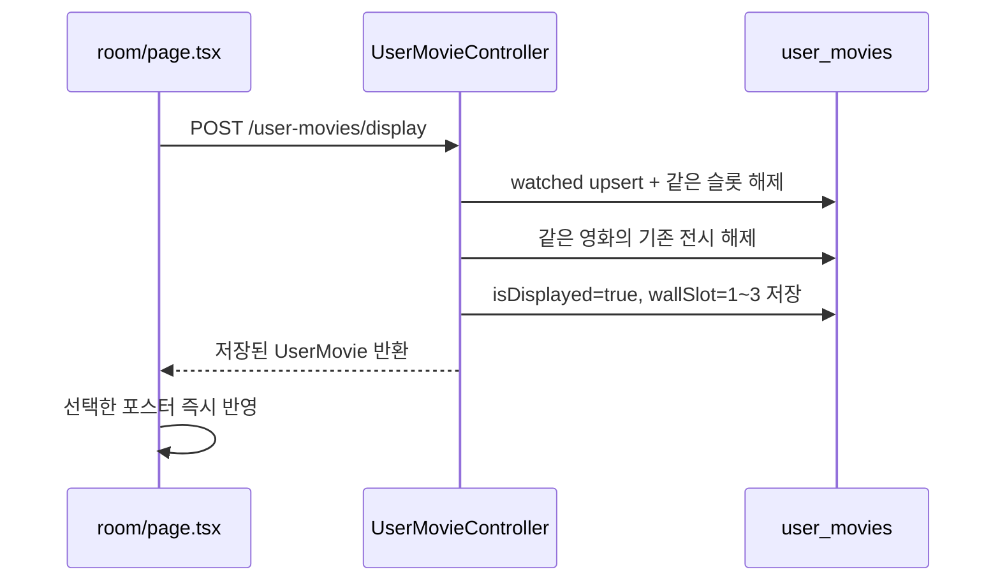

# UserMovie (찜 · 봤어요)

관련 코드:

```txt
apps/api/prisma/schema.prisma          UserMovie · UserMovieKind(wish|watched)
apps/api/src/user-movie/               toggle · marks · counts · listByKind(page, filters)
apps/api/src/tmdb/tmdb.service.ts      list → getMovieCached (풀 hit면 TMDB 0)
apps/api/src/ticket/ticket.service.ts  use 시 watched exclude
packages/shared/src/user-movie.ts
apps/web/lib/user-movie-api.ts
apps/web/app/gacha/page.tsx            결과 카드 marks
apps/web/app/room/page.tsx             입구 · AvatarFigure · 스타일룸 · 관람 기록/보고 싶은 영화 링크 · 포스터 벽
apps/web/components/room/PosterPickerModal.tsx
                                      영화 제목 검색 · 포스터 선택
apps/web/app/room/wish/page.tsx
apps/web/app/room/watched/page.tsx
apps/web/components/room/MovieShelf.tsx
apps/web/components/room/AvatarFigure.tsx · WardrobeModal.tsx · ProfileModal.tsx
apps/web/app/styles/room.css · avatar.css · profile.css
```

가챠 → [gacha.md](./gacha.md)  
아바타·옷방 → [avatar.md](./avatar.md)  
프로필 → [profile.md](./profile.md)  
스키마 → [prisma/current-model.md](../prisma/current-model.md)

---

## 모델

```txt
UserMovie
  id
  userId
  tmdbId
  kind: wish | watched
  watchedAt: DateTime | null         // watched 전용 관람일, Timestamptz
  isDisplayed: boolean
  displayOrder: number | null
  wallSlot: number | null       // 포스터 위치 1~3
  createdAt
  updatedAt

@@unique([userId, tmdbId, kind])
```

같은 영화에 wish와 watched를 **각각** 둘 수 있음 (행 2개).  
선반 UX에서는 찜 → 봤어요 이동 시 wish를 끄고 watched를 켠다.

---

## API (JWT)

| 메서드 | 경로 | 역할 |
|--|--|--|
| `POST` | `/v1/user-movies/toggle` | `{ tmdbId, kind }` → `{ tmdbId, kind, active }` |
| `GET` | `/v1/user-movies/marks?tmdbId=` | `{ tmdbId, wish, watched }` |
| `GET` | `/v1/user-movies/counts` | `{ wish, watched }` 개수 |
| `GET` | `/v1/user-movies?kind=&page=&limit=&search=&year=&month=` | 선반 목록·검색·기간 필터 |
| `POST` | `/v1/user-movies/watched-at` | 영화별 관람일 추가·변경(upsert) |
| `PATCH` | `/v1/user-movies/watched-at` | 영화별 관람일 수정 |
| `DELETE` | `/v1/user-movies/watched-at/:tmdbId` | 관람 기록 삭제 |
| `GET` | `/v1/user-movies/calendar?year=&month=` | 월별 영화 달력 데이터 |
| `GET` | `/v1/user-movies/stats?year=` | 연도별·월별 관람 통계 |
| `POST` | `/v1/user-movies/display` | `watched` 추가·포스터 전시 위치 저장 |
| `GET` | `/v1/user-movies/displayed` | 현재 전시 중인 포스터 목록 |

```txt
list 기본 page=1 · limit=24 (max 48)
응답: { items, page, total, hasMore }
items[].movie ← getMovieCached(tmdbId)
items[].watchedAt ← watched 목록이면 관람일, wish 목록이면 null

필터
  · search: 영화 제목·감독·개봉연도 검색
  · year만: 해당 연도 전체 관람 기록
  · month만: 모든 연도의 해당 월 관람 기록
  · year+month: 해당 연도의 해당 월 관람 기록
  · 관람일 범위는 Asia/Seoul(KST) 기준
```

---

## Shared

```txt
USER_MOVIE_KINDS
UserMovieKind
ToggleUserMovieResult
UserMovieMarks
UserMovieListItem      tmdbId · updatedAt · movie
UserMovieListPage      items · page · total · hasMore
UserMovieCounts        wish · watched
```

---

## Web API

```ts
toggleUserMovieRequest(token, tmdbId, kind)
getUserMovieMarksRequest(token, tmdbId)
getUserMovieCountsRequest(token)
listUserMoviesRequest(token, kind, page?, limit?, { search?, year?, month? })
addWatchedMovieRequest(token, tmdbId, watchedAt)
updateWatchedAtRequest(token, tmdbId, watchedAt)
removeWatchedMovieRequest(token, tmdbId)
getUserMovieCalendarRequest(token, year, month)
getUserMovieStatsRequest(token, year)
updateUserMovieDisplayRequest(token, { tmdbId, kind: 'watched', isDisplayed, wallSlot })
listDisplayedUserMoviesRequest(token)
```

## 관람일·영화 달력

```txt
/room
  · 관람일 카드 클릭 → MovieCalendarModal
  · 관람일 카드에는 오늘 KST 날짜와 요일을 항상 표시
  · 실제 최근 관람일만 별도 날짜 칩으로 표시하며 임시 날짜는 표시하지 않음
  · 연도 select: 2000년부터 현재 KST 연도까지 이동
  · 월 select 또는 이전·오늘·다음 버튼으로 월 이동
  · 오늘 날짜와 오늘 이전 날짜에만 + 버튼 노출
  · 날짜 클릭 → 해당 날짜에 본 영화 표시
  · + 클릭 → PosterPickerModal을 달력 앞에 표시
  · 영화 선택 → watched upsert + watchedAt 저장
  · 기존 영화 선택 → 같은 영화의 관람일을 새 날짜로 변경
  · 관람 기록 삭제 → UserMovie watched 행 삭제
```

```txt
영화 1편당 관람일 1개만 저장
  · @@unique([userId, tmdbId, kind]) 유지
  · 여러 번 본 이력은 현재 지원하지 않음
  · 반복 관람 이력이 필요해지면 movieViewingHistory 별도 모델 검토
```

관람일은 날짜 의미가 핵심이므로 `watchedAt`은 `Timestamptz`로 저장하되, 생성·수정·조회 시 KST 달력 날짜로 변환함. 서버의 `date-kst.ts`가 월·일 범위를 `[start, end)`로 계산함.

## 관람 기록 선반

```txt
/room/watched
  · 영화 제목·감독·개봉연도 검색
  · 관람 연도만, 관람 월만, 연도+월 조합 필터
  · 검색·필터 값은 서버 API query로 전달
  · 결과 카드에 `관람 YYYY.MM.DD` 표시
  · 다음 페이지 요청에도 검색·연도·월 필터 유지
  · 필터 변경 중 이전 페이지 응답이 섞이지 않도록 요청 버전 확인
```

검색어가 있는 경우 영화 메타데이터(`title`, `director`, `release_date`)를 기준으로 서버에서 필터링한 뒤 페이지를 계산함. 현재 영화 메타데이터가 `MoviePool`/TMDB 캐시에 있으므로, 검색 필터에서는 후보 UserMovie를 읽고 `getMovieCached()` 결과를 비교함.

## 관람 통계

```txt
GET /v1/user-movies/stats?year=2026
  → { year, total, monthly: [{ month: 1..12, count }] }

/room/watched
  · MovieStatsPanel에서 연도 선택
  · 선택한 연도의 전체 관람 수와 1~12월 관람 수 표시
  · 월별 데이터는 `watchedAt`을 KST 기준으로 집계
```

## 내 방 포스터 전시

```txt
/room
  · 벽에 포스터 슬롯 3개 제공 (wallSlot 1~3)
  · 빈 슬롯 클릭 → PosterPickerModal
  · 영화 제목 검색 → TMDB /v1/tmdb/search
  · 영화 선택 → 봤어요 추가와 전시 저장을 한 번에 처리
  · 이미 봤어요인 영화도 같은 요청으로 전시 위치만 변경
  · 이미 다른 칸에 전시 중인 영화는 기존 전시를 해제하고 새 칸으로 이동
```

## 내 방 화면 배치

방 내부 오브젝트는 각 요소를 화면 좌표에 고정하지 않고 `.room-scene-layout`의 Grid 셀에 배치함.

```txt
데스크톱
  1행: 포스터 3칸 | 관람일·명대사 화이트보드 카드 2개
  2행: 고객센터   | 스타일룸       | 프로필 영역 시작
  3행: 관람 기록   | 명대사 모음집   | 보고 싶은 영화 | 프로필 영역 계속
       프로필 영역은 오른쪽 열의 2~3행을 차지해 말풍선·아바타·태그가 늘어날 공간을 확보

아이패드·모바일
  1행: 포스터 3칸 전체 폭
  2행: 관람일 | 명대사 화이트보드
  3행: 고객센터 | 프로필 | 스타일룸
  4행: 관람 기록 | 명대사 모음집 | 보고 싶은 영화
       프로필 행은 캐릭터 콘텐츠 높이에 맞춰 확장
```

관련 구조:

```txt
room/page.tsx
  room-scene
    room-scene-wall · room-scene-floor
    room-scene-layout
      room-poster-wall
      room-feature-boards
        room-feature-board--calendar
        room-feature-board--whiteboard
      room-object · room-me

room.css
  room-scene-layout 단일 Grid 기준
  데스크톱 → 4열 · 3행, 프로필은 오른쪽 2~3행
  max-width: 60rem → 3열 · 기능 카드 2열 · 메뉴 별도 행
  max-width: 30rem → 캐릭터 행 max-content · 방 세로 비율 1:1.75
```

배치 관련 CSS를 수정할 때 기존 `top`, `left`, `right`, `bottom` 좌표를 추가하지 않고 Grid 열·행과 영역 크기를 조정함. 기능 카드는 `room-feature-boards` 안에서만 크기와 간격을 변경함.

모바일에서 `room-me`의 말풍선·아바타·닉네임·태그가 하단 메뉴를 침범하지 않도록 캐릭터 행을 콘텐츠 최대 높이로 예약함. 작은 화면에서는 고정된 가로세로 비율만 유지하지 않고 `.room-scene`의 세로 공간도 함께 확보함.

### 저장 흐름



`updateDisplay()`는 서버 트랜잭션 안에서 처리함. 프론트가 `marks 조회 → watched toggle → 전시 저장`을 따로 호출하지 않으므로 중간 실패·중복 클릭으로 상태가 어긋날 가능성을 줄임.

새로고침 시에는 로컬 상태를 믿지 않고 `GET /v1/user-movies/displayed`를 다시 호출함. 응답 형태는 배열이 아니라 `{ items }`이며, 각 item의 `wallSlot`을 기준으로 화면 슬롯을 복원함.

> [!note] 포스터 데이터 저장 기준
> `UserMovie`에는 포스터 이미지나 제목을 저장하지 않음. `tmdbId`와 전시 위치만 저장하고, 표시할 때 `getMovieCached(tmdbId)`로 영화 메타데이터를 조합함.

---

## toggle 정리 (헷갈리기 쉬운 부분)

### 서버 `POST /user-movies/toggle` — 한 kind만 on/off

```txt
입력: { tmdbId, kind }   kind = wish | watched 중 하나
동작: 그 (userId, tmdbId, kind) 행이
  · 있으면 DELETE → { active: false }
  · 없으면 CREATE → { active: true }

중요
  · wish 토글은 watched 행을 건드리지 않음
  · watched 토글은 wish 행을 건드리지 않음
  · “이동” API는 없음. 이동은 클라이언트가 toggle을 두 번 호출
```

### DB에 가능한 상태 (영화 1편 기준)

```txt
(없음)              wish ❌  watched ❌
찜만                wish ✅  watched ❌
봤어요만            wish ❌  watched ✅
둘 다               wish ✅  watched ✅   ← API상 허용
```

가챠 `marks`는 위 네 가지를 `{ wish, watched }`로만 보여 줌.

### 클라이언트 UX (선반 MovieShelf) — API 위에 얹은 규칙

서버는 독립 toggle만 한다. **선반에서만** 아래처럼 묶는다.

| 화면 | 버튼 | 기대 | 실제 호출 |
|--|--|--|--|
| 찜 선반 | 찜 OFF | 찜 선반에서 빠짐 | `toggle(wish)` → active false |
| 찜 선반 | 봤어요 ON | 봤어요로 **이동** (찜 해제) | `toggle(watched)` + `toggle(wish)` 병렬 · UI 즉시 제외 |
| 봤어요 선반 | 봤어요 OFF | 봤어요 선반에서 빠짐 | `toggle(watched)` → active false |
| 봤어요 선반 | 찜 ON/OFF | 목록은 그대로 · 마크만 변경 | `toggle(wish)` 만 |
| 가챠 결과 카드 | 찜 / 봤어요 | 각각 독립 on/off · 카드는 안 사라짐 | `toggle` 1회씩 |

```txt
용어
  · API toggle     = kind 하나 켜고/끄기 (진실은 DB)
  · 선반 “이동”    = wish OFF + watched ON (클라이언트 조합)
  · leaveShelf     = 지금 보고 있는 선반 목록에서 카드 제거
                     (현재 kind OFF 또는 찜→봤어요 이동)
```

낙관적 UI: 선반에서는 화면을 먼저 바꾸고, 실패하면 목록·마크 롤백.

### 한 줄 암기

```txt
서버: kind별 스위치
선반: 찜→봤어요는 “이동” (스위치 두 개)
가챠: 스위치만 (이동 없음)
```

---

## 내 방 · 선반 UI

```txt
/room                 입구 (말풍선·아바타·태그 · 포스터 벽 · 공간 링크)
/room/wish            찜 선반
/room/watched         봤어요 선반

캐릭터 · 프로필 · 옷방
  · 말풍선: bio 또는 「프로필 작성하려면 클릭하세요」→ ProfileModal
  · AvatarFigure + 아래 #태그 최대 3
  · 프로필 구역 버튼 없음 (말풍선이 입구)
  · 옷방 WardrobeModal · PATCH /auth/avatar
  · 상세 → [avatar.md](./avatar.md) · [profile.md](./profile.md)

공간 링크
  · 관람 기록 → /room/watched
  · 보고 싶은 영화 → /room/wish
  · 명대사 모음 → /room/quotes
  · 스타일룸 → WardrobeModal
  · 고객센터 → 전화기 아이콘, 현재 준비 중

포스터 벽
  · 창문과 포스터 벽의 사용자 지정 그림 액자 전환은 보류

선반 (MovieShelf)
  · 포스터 그리드 카드
  · 카드 클릭 → MovieDetailModal에서 포스터·제목·연도·감독·줄거리 확인
  · 상세 설명 글자 크기 확대/축소 지원
  · 마크는 카드 정보 영역의 아이콘 버튼 (중첩 button 금지)
  · 영화 제목·감독·개봉연도로 검색
  · 관람 기록 선반은 관람 연도·월 필터 지원
  · `watched` 카드에는 관람일 `YYYY.MM.DD` 표시
  · 무한 스크롤: scroll 영역 + loadMoreTriggerRef · IntersectionObserver
  · page 단위 24개

토글 UX (상세 → 위 «toggle 정리»)
  · 현재 선반 kind OFF → leaveShelf
  · 찜 선반에서 봤어요 ON → 이동 (wish OFF + watched ON · Promise.all · 낙관적 UI)
  · 가챠 카드는 kind 독립 토글만
```

가챠 결과 카드 marks는 Heart/Check 칩 (이동 로직 없음).

---

## 함정 · 버그 메모

### 이전 플립 카드에서 발생한 마크 button 중첩 문제

현재는 플립 카드를 사용하지 않음. 아래 내용은 재발 방지용 과거 버그 기록임.

증상:

```txt
선반에서 찜 / 봤어요 클릭이 안 먹거나
카드만 뒤집히고 토글이 안 됨
(또는 button 중첩 hydration 경고)
```

원인:

```txt
플립 컨테이너를 <button> 또는 role="button"으로 두고
그 안에 <button class="room-mark">를 넣음
→ 중첩 interactive / 클릭이 부모 뒤집기로 먹힘
→ HTML: button cannot be a descendant of button
```

해결:

```txt
구조
  <li class="room-movie">
    <div role="button" class="room-flip"> … 앞/뒤 면만 … </div>
    <div class="room-flip-marks">
      <button>찜</button>
      <button>봤어요</button>
    </div>
  </li>

마크는 플립 밖. 가챠 결과도 마크는 모달 actions 쪽(플립 밖).
```

관련: `MovieShelf.tsx` · `MovieDetailModal.tsx` · `room.css` (`.room-movie` grid)

---

## listByKind

**한 줄:** kind별 목록을 페이지로 주고, 각 칸에 카드용 `movie`를 붙인다.

```txt
marks / toggle / list / counts
  · marks   → 영화 1편 플래그 (가챠·플립)
  · toggle  → 1편 kind on/off
  · list    → kind 목록 페이지 (선반)
  · counts  → 입구 문 뱃지

처리
  1. count + findMany(skip/take, updatedAt desc)
  2. row마다 getMovie
  3. { items, page, total, hasMore }
```

N+1은 MVP. 목록이 커지면 MoviePool/캐시.

---

## 가챠 연결

```txt
POST /tickets/use
  → kind=watched tmdbId[] exclude
  → pickRandomMovie(filters, excludeIds)
```

---

## 나중에

### 후기방 유도 모달

**안 함.** `watched` ON 직후 후기방 유도하지 않음 · 후기 영화는 TMDB 검색 → [review.md](./review.md)

### MoviePool (**지금 할 것**)

**풀** = DB에 쟁여 둔 영화 상자. → [tmdb.md](./tmdb.md) · [prisma/current-model.md](../prisma/current-model.md)

선반 list의 getMovie N번을 `getMovieCached`로 줄이는 것부터.
